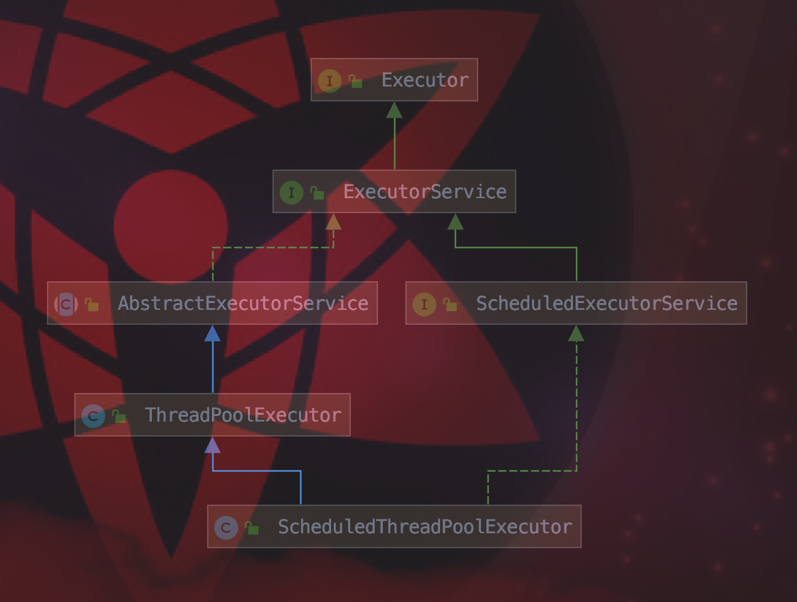

## J.U.C线程池: 线程池基础架构

我们先看线程池的UML基础架构图:



**Executor:** 任务的执行者, 线程池框架中几乎所有类都直接或者间接实现Executor接口, 它是线程池框架的基础。

Executor提供一种将**任务提交**和**任务执行**分离开来的机制, 它仅提供了一个`Executor()`方法来执行已经提交的Runnable任务。

```java
public interface Executor {
    void execute(Runnable command);
}
```

**ExecutorService:** 继承Executor, 它提供的更加丰富的功能。例如: 任务的提交, 任务的执行, 执行的关闭.

```java
public interface ExecutorService extends Executor {

    /**
     * 启动一次顺序关闭，执行以前提交的任务，但不接受新任务
     */
    void shutdown();

    /**
     * 试图停止所有正在执行的活动任务，暂停处理正在等待的任务，并返回等待执行的任务列表
     */
    List<Runnable> shutdownNow();

    /**
     * 如果此执行程序已关闭，则返回 true。
     */
    boolean isShutdown();

    /**
     * 如果关闭后所有任务都已完成，则返回 true
     */
    boolean isTerminated();

    /**
     * 请求关闭、发生超时或者当前线程中断，无论哪一个首先发生之后，都将导致阻塞，直到所有任务完成执行
     */
    boolean awaitTermination(long timeout, TimeUnit unit)
        throws InterruptedException;

    /**
     * 提交一个返回值的任务用于执行，返回一个表示任务的未决结果的 Future
     */
    <T> Future<T> submit(Callable<T> task);

    /**
     * 提交一个 Runnable 任务用于执行，并返回一个表示该任务的 Future
     */
    <T> Future<T> submit(Runnable task, T result);

    /**
     * 提交一个 Runnable 任务用于执行，并返回一个表示该任务的 Future
     */
    Future<?> submit(Runnable task);

    /**
     * 执行给定的任务，当所有任务完成时，返回保持任务状态和结果的 Future 列表
     */
    <T> List<Future<T>> invokeAll(Collection<? extends Callable<T>> tasks)
        throws InterruptedException;

    /**
     * 执行给定的任务，当所有任务完成或超时期满时（无论哪个首先发生），返回保持任务状态和结果的 Future 列表
     */
    <T> List<Future<T>> invokeAll(Collection<? extends Callable<T>> tasks,
                                  long timeout, TimeUnit unit)
        throws InterruptedException;

    /**
     * 执行给定的任务，如果某个任务已成功完成（也就是未抛出异常），则返回其结果
     */
    <T> T invokeAny(Collection<? extends Callable<T>> tasks)
        throws InterruptedException, ExecutionException;

    /**
     * 执行给定的任务，如果在给定的超时期满前某个任务已成功完成（也就是未抛出异常），则返回其结果
     */
    <T> T invokeAny(Collection<? extends Callable<T>> tasks,
                    long timeout, TimeUnit unit)
        throws InterruptedException, ExecutionException, TimeoutException;
}
```

**AbstractExecutorService:** 抽象类。实现`ExecutorService`接口, 为期提供默认实现。

**ScheduledExecutorService:** 继承`ExecutorService`, 实现延迟和定期执行的ExecutorService。

```java
// 创建并执行在给定延迟后启用的 ScheduledFuture。
<V> ScheduledFuture<V> schedule(Callable<V> callable, long delay, TimeUnit unit)

// 创建并执行在给定延迟后启用的一次性操作。
ScheduledFuture<?> schedule(Runnable command, long delay, TimeUnit unit)

// 创建并执行一个在给定初始延迟后首次启用的定期操作，后续操作具有给定的周期；
//也就是将在 initialDelay 后开始执行，然后在 initialDelay+period 后执行，接着在 initialDelay + 2 * period 后执行，依此类推。
ScheduledFuture<?> scheduleAtFixedRate(Runnable command, long initialDelay, long period, TimeUnit unit)

// 创建并执行一个在给定初始延迟后首次启用的定期操作，随后，在每一次执行终止和下一次执行开始之间都存在给定的延迟。
ScheduledFuture<?> scheduleWithFixedDelay(Runnable command, long initialDelay, long delay, TimeUnit unit)

```

**ThreadPoolExecutor:** 是真正线程池的创建工具类。

**ScheduledThreadPoolExecutor:** ScheduledThreadPoolExecutor继承ThreadPoolExecutor并且实现ScheduledExecutorService接口，是两者的集大成者。相当于提供了**延迟**和**周期执行**功能的`ThreadPoolExecutor`。

**Executors:** 静态工厂类, 提供了`Executor`, `ExecutorService`, `ScheduledExecutorService`, `ThreadFactory`, `Callable`等类的静态工厂方法。

**Future:** 接收线程的执行结果。可能还没有完成的异步任务的结果, 针对这个结果可以添加Callable以便在任务执行成功或失败后作出相应的操作。对具体的Runnable或者Callable任务提供了三种操作: 执行任务的取消, 查询任务是否完成, 获取任务的执行结果。

```java
public interface Future<V> {

    /**
     * 试图取消对此任务的执行
     * 如果任务已完成、或已取消，或者由于某些其他原因而无法取消，则此尝试将失败。
     * 当调用 cancel 时，如果调用成功，而此任务尚未启动，则此任务将永不运行。
     * 如果任务已经启动，则 mayInterruptIfRunning 参数确定是否应该以试图停止任务的方式来中断执行此任务的线程
     */
    boolean cancel(boolean mayInterruptIfRunning);

    /**
     * 如果在任务正常完成前将其取消，则返回 true
     */
    boolean isCancelled();

    /**
     * 如果任务已完成，则返回 true
     */
    boolean isDone();

    /**
     *   如有必要，等待计算完成，然后获取其结果
     */
    V get() throws InterruptedException, ExecutionException;

    /**
     * 如有必要，最多等待为使计算完成所给定的时间之后，获取其结果（如果结果可用）
     */
    V get(long timeout, TimeUnit unit)
        throws InterruptedException, ExecutionException, TimeoutException;
}
```

**RunnableFuture:** 继承Future, Runnable接口。提供一个run()方法可以完成Future并允许访问其结果。

**FutureTask:** 实现`RunnableFuture`接口, 既可以作为Runnable被执行, 也可以作为Future得到Callable的返回值。