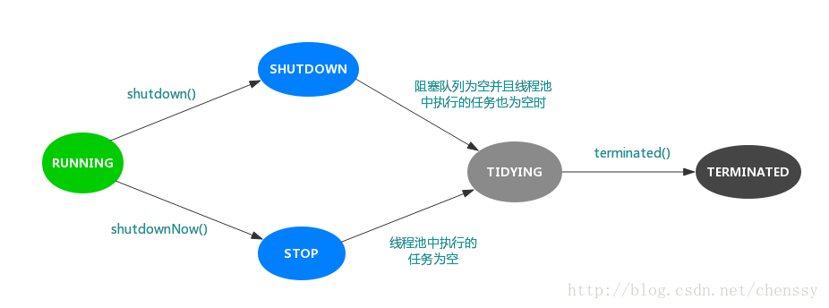

## J.U.C线程池: ThreadPoolExecutor

`ThreadPoolExecutor`是`Executor`框架中最核心的类, 所以深入了解它是非常有必要的。

### 内部状态

线程有五种状态: 新建, 就绪, 运行, 阻塞, 死亡。线程池同样也有五种状态: **RUNNING, SHUTDOWN, STOP, TIDYING, TERMINATED。**

```java
// 利用ctl来保证线程池的状态和当前的线程数量。低29位为线程池的容量, 高3位为线程状态
private final AtomicInteger ctl = new AtomicInteger(ctlOf(RUNNING, 0));
// 设定偏移量
private static final int COUNT_BITS = Integer.SIZE - 3;
// 确定最大的容量2^29-1
private static final int CAPACITY   = (1 << COUNT_BITS) - 1;

// runState is stored in the high-order bits
// 111
private static final int RUNNING    = -1 << COUNT_BITS;
// 000
private static final int SHUTDOWN   =  0 << COUNT_BITS;
// 001
private static final int STOP       =  1 << COUNT_BITS;
// 010
private static final int TIDYING    =  2 << COUNT_BITS;
// 011
private static final int TERMINATED =  3 << COUNT_BITS;

// Packing and unpacking ctl
private static int runStateOf(int c)     { return c & ~CAPACITY; }
private static int workerCountOf(int c)  { return c & CAPACITY; }
private static int ctlOf(int rs, int wc) { return rs | wc; }
```

**变量ctl定义为AtomicInteger, 同时它里面包含了两个field, 一个是workerCount, 另一个是runState**

**workerCount表示当前有效的线程数, 也就是Worker的数量: 它占据atomic integer的后29位， 上限是(2^29)-1**

**runState表示当前线程池的状态, 占据atomic integer的前3位**

```java
RUNNING          -- 对应的高3位值是111。
SHUTDOWN         -- 对应的高3位值是000。
STOP             -- 对应的高3位值是001。
TIDYING          -- 对应的高3位值是010。
TERMINATED       -- 对应的高3位值是011。
```

- **Running**: 可以接受新任务, 同时可以处理queue中的任务
- **shutdown**: 不能接受新任务, 但是可以处理queue中的任务
- **stop**: 不接受新任务, 同时不处理queue中的任务, 并且会中断正在处理的任务
- **tidying**: 当所有queue中的任务已终止，并且线程池中的线程为空(也就是workerCount为0)，线程池会变为TIDYING状态。当线程池变为TIDYING状态时，会执行钩子函数terminated()。terminated()在ThreadPoolExecutor类中是空的，若用户想在线程池变为TIDYING时，进行相应的处理；可以通过重载terminated()函数来实现。
- **terminated**: 线程池彻底终止的状态。

各个状态的转换如下:



### 线程池核心参数

我们可以通过`ThreadPoolExecutor`构造函数来创建一个线程池:

```java
 /**
 * Creates a new {@code ThreadPoolExecutor} with the given initial
 * parameters and default thread factory.
 *
 * @param corePoolSize the number of threads to keep in the pool, even
 *        if they are idle, unless {@code allowCoreThreadTimeOut} is set
 * @param maximumPoolSize the maximum number of threads to allow in the
 *        pool
 * @param keepAliveTime when the number of threads is greater than
 *        the core, this is the maximum time that excess idle threads
 *        will wait for new tasks before terminating.
 * @param unit the time unit for the {@code keepAliveTime} argument
 * @param workQueue the queue to use for holding tasks before they are
 *        executed.  This queue will hold only the {@code Runnable}
 *        tasks submitted by the {@code execute} method.
 * @param handler the handler to use when execution is blocked
 *        because the thread bounds and queue capacities are reached
 * @throws IllegalArgumentException if one of the following holds:<br>
 *         {@code corePoolSize < 0}<br>
 *         {@code keepAliveTime < 0}<br>
 *         {@code maximumPoolSize <= 0}<br>
 *         {@code maximumPoolSize < corePoolSize}
 * @throws NullPointerException if {@code workQueue}
 *         or {@code handler} is null
 */
public ThreadPoolExecutor(int corePoolSize,
                              int maximumPoolSize,
                              long keepAliveTime,
                              TimeUnit unit,
                              BlockingQueue<Runnable> workQueue,
                              ThreadFactory threadFactory,
                              RejectedExecutionHandler handler) {
    if (corePoolSize < 0 ||
        maximumPoolSize <= 0 ||
        maximumPoolSize < corePoolSize ||
        keepAliveTime < 0)
        throw new IllegalArgumentException();
    if (workQueue == null || threadFactory == null || handler == null)
        throw new NullPointerException();
    this.acc = System.getSecurityManager() == null ?
            null :
            AccessController.getContext();
    this.corePoolSize = corePoolSize;
    this.maximumPoolSize = maximumPoolSize;
    this.workQueue = workQueue;
    this.keepAliveTime = unit.toNanos(keepAliveTime);
    this.threadFactory = threadFactory;
    this.handler = handler;
}
```

`ThreadPoolExecutor`构造函数总共有7个参数, 这7个参数的意思一定要非常熟悉且理解, 极其重要的知识点。而对于这些参数的解释其实在源码中, 已经写得非常详细了。

> **corePoolSize:** 核心线程数。线程池中固定保持多少个线程, 即使线程是空闲的。当提交一个任务时, 线程池会新建一个线程来执行任务, 知道当前线程数等于corePoolSize。
>
> **maximumPoolSize:** 最大线程数。线程池中允许存在线程的最大数量。
>
> **keepAliveTime:** 线程空闲时间。线程的创建和销毁是需要代价的。线程执行完任务后不会立即销毁, 而是继续存活一段时间: keepAliveTime。默认情况下, 该参数只有线程数大于corePoolSize时才会生效。
>
> **unit:** keepAliveTime存活时间的单位。
>
> **workQueue:** 用来保存等待执行的任务的阻塞队列。等待的任务必须实现Runnable接口。
>
> **threadFactory:** 用于设置创建线程的工厂。ThreadFactory
>
> **RejectedExecutionHandler:** 线程池的拒绝策略。所谓拒绝策略, 是指将任务添加到线程池中, 线程池拒绝该任务所采取的的相应策略。

**这里的参数关系一定要搞清楚:**

**`corePoolSize`是核心线程大小, 线程池中固定保持多少个线程;**<br/>
**`workQueue`任务队列的作用是当线程池中正在执行任务的线程数量已达到核心线程数时, 再次提交任务就会先存到队列中进行等待, 直到达到队列的大小;**<br/>
**`maximumPoolSize`最大线程数, 是线程池允许存在的最大的线程数量。当`workQueue`等待任务已满时, 线程池就会从核心线程数扩充到最大线程数;**

> 这三个参数的关系: 当执行任务的线程数量达到核心线程数`corePoolSize`时, 提交的任务会存在`wokrQueue`等待执行; 但是如果提交任务过多, 达到了`workQueue`的大小, 那么线程池数量就会扩充到最大线程数`maximumPoolSize`; 而如果此时任务仍然不断的提交, 达到了最大线程数, 那么就会执行相应的拒绝策略。

按照上面的解释, 如果corePoolSize = 1, maximumPoolSize = 2, workQueue.size = 1; 如果任务执行时间过长< 导致线程还没来得及回收, 那么最多只能提交3个任务。当提交第4个任务是就会执行拒绝策略。

### execute() 方法分析

`ThreadPoolExecutor`通过`execute()`和`submit()`来提交任务, 我们先看`execute()`的源码:

```java
public void execute(Runnable command) {
    if (command == null)
        throw new NullPointerException();

    // 返回包含线程数及线程池状态（头3位）
    int c = ctl.get();
    
    // 如果工作线程数小于核心线程数，则创建线程任务执行
    if (workerCountOf(c) < corePoolSize) {
        
        if (addWorker(command, true))
            return;
            
        // 如果创建失败，防止外部已经在线程池中加入新任务，重新获取
        c = ctl.get();
    }
    
    // 只有线程池处于 RUNNING 状态，且 入队列成功
    if (isRunning(c) && workQueue.offer(command)) {
    　　// 后面的操作属于double-check
        int recheck = ctl.get();
        
        // 如果线程池不是 RUNNING 状态，则将刚加入队列的任务移除
        if (!isRunning(recheck) && remove(command))
            reject(command);
            
        // 如果之前的线程已被消费完，新建一个线程
        else if (workerCountOf(recheck) == 0)
            addWorker(null, false);
    }
    // 核心池和队列都满了，尝试创建一个新线程
    else if (!addWorker(command, false))
        // 如果 addWorker 返回是 false，即创建失败，则唤醒拒绝策略
        reject(command);
}
```

这里要明确一点:
> **Work和Task的区别, Work是当前线程池中的线程, 而Task虽然是runnable, 但是并没有真正执行, 只是被Work调用了run方法。**

### 核心方法addWork

Work的增加和Task的获取以及终止都是在`addWork`方法中实现的, 在此方法中提到了Status的概念, Status是线程池的核心概念。我们之前已经说过了

```java
    /**
     * Checks if a new worker can be added with respect to current
     * pool state and the given bound (either core or maximum). If so,
     * the worker count is adjusted accordingly, and, if possible, a
     * new worker is created and started running firstTask as its
     * first task. This method returns false if the pool is stopped or
     * eligible to shut down. It also returns false if the thread
     * factory fails to create a thread when asked, which requires a
     * backout of workerCount, and a recheck for termination, in case
     * the existence of this worker was holding up termination.
     *
     * @param firstTask the task the new thread should run first (or
     * null if none). Workers are created with an initial first task
     * (in method execute()) to bypass queuing when there are fewer
     * than corePoolSize threads (in which case we always start one),
     * or when the queue is full (in which case we must bypass queue).
     * Initially idle threads are usually created via
     * prestartCoreThread or to replace other dying workers.
     *
     * @param core if true use corePoolSize as bound, else
     * maximumPoolSize. (A boolean indicator is used here rather than a
     * value to ensure reads of fresh values after checking other pool
     * state).
     * @return true if successful
     */
    private boolean addWorker(Runnable firstTask, boolean core) {
        retry:
        for (;;) {
            int c = ctl.get();
            int rs = runStateOf(c);
            // Check if queue empty only if necessary.
            /**
             * rs!=Shutdown || fistTask！=null || workCount.isEmpty
             * 如果当前的线程池的状态>SHUTDOWN 那么拒绝Worker的add 如果=SHUTDOWN
             * 那么此时不能新加入不为null的Task，如果在WorkCount为empty的时候不能加入任何类型的Worker，
             * 如果不为empty可以加入task为null的Worker,增加消费的Worker
             */
            if (rs >= SHUTDOWN &&
                ! (rs == SHUTDOWN &&
                   firstTask == null &&
                   ! workQueue.isEmpty()))
                return false;

            for (;;) {
                int wc = workerCountOf(c);
                if (wc >= CAPACITY ||
                    wc >= (core ? corePoolSize : maximumPoolSize))
                    return false;
                if (compareAndIncrementWorkerCount(c))
                    break retry;
                c = ctl.get();  // Re-read ctl
                if (runStateOf(c) != rs)
                    continue retry;
                // else CAS failed due to workerCount change; retry inner loop
            }
        }

        Worker w = new Worker(firstTask);
        Thread t = w.thread;

        final ReentrantLock mainLock = this.mainLock;
        mainLock.lock();
        try {
            // Recheck while holding lock.
            // Back out on ThreadFactory failure or if
            // shut down before lock acquired.
            int c = ctl.get();
            int rs = runStateOf(c);
            /**
             * rs!=SHUTDOWN ||firstTask!=null
             * 
             * 同样检测当rs>SHUTDOWN时直接拒绝减小Wc，同时Terminate，如果为SHUTDOWN同时firstTask不为null的时候也要Terminate
             */
            if (t == null ||
                (rs >= SHUTDOWN &&
                 ! (rs == SHUTDOWN &&
                    firstTask == null))) {
                decrementWorkerCount();
                tryTerminate();
                return false;
            }

            workers.add(w);

            int s = workers.size();
            if (s > largestPoolSize)
                largestPoolSize = s;
        } finally {
            mainLock.unlock();
        }

        t.start();
        // It is possible (but unlikely) for a thread to have been
        // added to workers, but not yet started, during transition to
        // STOP, which could result in a rare missed interrupt,
        // because Thread.interrupt is not guaranteed to have any effect
        // on a non-yet-started Thread (see Thread#interrupt).
        //Stop或线程Interrupt的时候要中止所有的运行的Worker
        if (runStateOf(ctl.get()) == STOP && ! t.isInterrupted())
            t.interrupt();
        return true;
    }
```

这段代码时比较复杂的, 所以我们分为几部分。

#### 判断线程池状态

```java
int c = ctl.get();
int rs = runStateOf(c);

// Check if queue empty only if necessary.
//判断当前线程池的状态是不是已经shutdown，如果shutdown了拒绝线程加入
//(rs!=SHUTDOWN || first!=null || workQueue.isEmpty())
//如果rs不为SHUTDOWN，此时状态是STOP、TIDYING或TERMINATED，所以此时要拒绝请求
//如果此时状态为SHUTDOWN，而传入一个不为null的线程，那么需要拒绝
//如果状态为SHUTDOWN，同时队列中已经没任务了，那么拒绝掉
if (rs >= SHUTDOWN &&
    ! (rs == SHUTDOWN &&
        firstTask == null &&
        ! workQueue.isEmpty()))
    return false;
```

**首先, 在rs>SHUTDOWN时, 拒绝一切线程的增加, 因为STOP会终止所有的线程, 同时移除Queue中所有的待执行的线程, 所以也不需要增加first=null的Worker了。**

**其次, 在SHUTDWON状态时, 是不能增加first!=null的Worker的, 同时即使first=null, 但是此时Queue为Empty也是不允许增加Worker的, SHUTDOWN下增加Worker主要用于消耗Queue中的任务。**
> 这里要注意的时, Worker是包含这个task的, 所以first!=null表示还存在待执行的任务, 而first=null则表示这个线程是闲置的, 为了消耗queue中的任务。

**SHUTDOWN状态时, 是不允许向workQueue中增加线程的, isRunning(c)&&workQueue.offer(command)每次在offer之前都要做状态检测, 也就是线程池状态变为>=SHUTDOWN时不允许新线程进入线程池了。**

#### 判断线程数
```java
for (;;) {
    int wc = workerCountOf(c);
    //如果当前的数量超过了CAPACITY，或者超过了corePoolSize和maximumPoolSize（试core而定）
    if (wc >= CAPACITY ||
        wc >= (core ? corePoolSize : maximumPoolSize))
        return false;
    //CAS尝试增加线程数，如果失败，证明有竞争，那么重新到retry。
    if (compareAndIncrementWorkerCount(c))
        break retry;
    c = ctl.get();  // Re-read ctl
    //判断当前线程池的运行状态
    if (runStateOf(c) != rs)
        continue retry;
    // else CAS failed due to workerCount change; retry inner loop
}
```

这段代码主要是判断 当前线程数没有到corePoolSize或maximumPoolSize上限时, 那么允许添加线程, CAS增加Worker数量后(compareAndIncrementWorkerCount(c)比较并新增workerCount), 跳出循环。**接下来实例化Worker, 这步很重要**

#### 实例化worker并启动任务
```java
Worker w = new Worker(firstTask);
Thread t = w.thread;

final ReentrantLock mainLock = this.mainLock;
mainLock.lock();
try {
    // Recheck while holding lock.
    // Back out on ThreadFactory failure or if
    // shut down before lock acquired.
    int c = ctl.get();
    int rs = runStateOf(c);
    /**
     * rs!=SHUTDOWN ||firstTask!=null
     * 
     * 同样检测当rs>SHUTDOWN时直接拒绝减小Wc，同时Terminate，如果为SHUTDOWN同时firstTask不为null的时候也要Terminate
     */
    if (t == null ||
        (rs >= SHUTDOWN &&
            ! (rs == SHUTDOWN &&
            firstTask == null))) {
        decrementWorkerCount();
        tryTerminate();
        return false;
    }

    workers.add(w);

    int s = workers.size();
    if (s > largestPoolSize)
        largestPoolSize = s;
} finally {
    mainLock.unlock();
}

t.start();
```
因为workers是HashSet线程不安全的, 所以需要加锁, 也就是`mainLock.lock()`;之后重新检查线程池的状态, 如果状态不正确, 那么减小Worker的数量; 如果状态正常, 那么添加Worker到workers。

最后:
```java
//Stop或线程Interrupt的时候要中止所有的运行的Worker
if (runStateOf(ctl.get()) == STOP && ! t.isInterrupted())
    t.interrupt();
```

注释中说的很清楚, **因为线程存在还未start时, 是不能响应中断的。而如果此时线程池状态变为STOP, 则不能中断线程。这里的代码就是为了判断 如果线程池STOP时, 并且此线程还未中断时(因为已开始的任务是无法中断的), 那么就将此线程中断。**

### 实例化Worker

先看下Worker的定义:

```java
private final class Worker
    extends AbstractQueuedSynchronizer
    implements Runnable
{
    /**
     * This class will never be serialized, but we provide a
     * serialVersionUID to suppress a javac warning.
     */
    private static final long serialVersionUID = 6138294804551838833L;

    /** Thread this worker is running in.  Null if factory fails. */
    final Thread thread;
    /** Initial task to run.  Possibly null. */
    Runnable firstTask;
    /** Per-thread task counter */
    volatile long completedTasks;

    /**
     * Creates with given first task and thread from ThreadFactory.
     * @param firstTask the first task (null if none)
     */
    Worker(Runnable firstTask) {
        setState(-1); // inhibit interrupts until runWorker
        this.firstTask = firstTask;
        this.thread = getThreadFactory().newThread(this);
    }

    /** Delegates main run loop to outer runWorker  */
    public void run() {
        runWorker(this);
    }

    // Lock methods
    //
    // The value 0 represents the unlocked state.
    // The value 1 represents the locked state.

    protected boolean isHeldExclusively() {
        return getState() != 0;
    }

    protected boolean tryAcquire(int unused) {
        if (compareAndSetState(0, 1)) {
            setExclusiveOwnerThread(Thread.currentThread());
            return true;
        }
        return false;
    }

    protected boolean tryRelease(int unused) {
        setExclusiveOwnerThread(null);
        setState(0);
        return true;
    }

    public void lock()        { acquire(1); }
    public boolean tryLock()  { return tryAcquire(1); }
    public void unlock()      { release(1); }
    public boolean isLocked() { return isHeldExclusively(); }

    void interruptIfStarted() {
        Thread t;
        if (getState() >= 0 && (t = thread) != null && !t.isInterrupted()) {
            try {
                t.interrupt();
            } catch (SecurityException ignore) {
            }
        }
    }
}
```

Worker是`ThreadPoolExecutor`的一个内部类, 它继承了AQS, 这里继承AQS的目的有三点:

1. 简化获取和释放锁的过程
2. 可以防止其他线程对这个工作线程的中断
3. 这里不使用`ReentrantLock`, 而是一个简单的不可重入互斥锁, 为了防止在其他地方调用`setCorePoolSize`时, 能够获取到这个锁。
4. 为了防止线程在真正开始运行任务之前发生中断, 一开始的状态就是负值, 也就是无法调用这个工作线程, 并且在runWorker方法中启动的时候清除这个状态

Worker还实现了Runnable接口, 说明Worker本身就是一个线程。而它的构造函数:

```java
Worker(Runnable firstTask) {
    setState(-1); // inhibit interrupts until runWorker
    this.firstTask = firstTask;
    this.thread = getThreadFactory().newThread(this);
}
```
这里可以看出Worker是对task的一个包装, 通过ThreadFactory为Worker构建一个线程。所以addWorker()方法中, t.start()方法就是调用worker实例中的run方法。

```java
/** Delegates main run loop to outer runWorker  */
public void run() {
    runWorker(this);
}
```

Worker中的run()方法, 又调用线程池中的`runWorker`:

#### ThreadPoolExecutor中的runnWorker方法

```java
/**
 * Main worker run loop.  Repeatedly gets tasks from queue and
 * executes them, while coping with a number of issues:
 * 1 Worker可能还是执行一个初始化的task——firstTask。
 *    但是有时也不需要这个初始化的task（可以为null）,只要pool在运行，就会
 *   通过getTask从队列中获取Task，如果返回null，那么worker退出。
 *   另一种就是external抛出异常导致worker退出。
 * 1. We may start out with an initial task, in which case we
 * don't need to get the first one. Otherwise, as long as pool is
 * running, we get tasks from getTask. If it returns null then the
 * worker exits due to changed pool state or configuration
 * parameters.  Other exits result from exception throws in
 * external code, in which case completedAbruptly holds, which
 * usually leads processWorkerExit to replace this thread.
 * 
 * 
 * 2 在运行任何task之前，都需要对worker加锁来防止other pool中断worker。
 *   clearInterruptsForTaskRun保证除了线程池stop，那么现场都没有中断标志
 * 2. Before running any task, the lock is acquired to prevent
 * other pool interrupts while the task is executing, and
 * clearInterruptsForTaskRun called to ensure that unless pool is
 * stopping, this thread does not have its interrupt set.
 *
 * 3. Each task run is preceded by a call to beforeExecute, which
 * might throw an exception, in which case we cause thread to die
 * (breaking loop with completedAbruptly true) without processing
 * the task.
 *
 * 4. Assuming beforeExecute completes normally, we run the task,
 * gathering any of its thrown exceptions to send to
 * afterExecute. We separately handle RuntimeException, Error
 * (both of which the specs guarantee that we trap) and arbitrary
 * Throwables.  Because we cannot rethrow Throwables within
 * Runnable.run, we wrap them within Errors on the way out (to the
 * thread's UncaughtExceptionHandler).  Any thrown exception also
 * conservatively causes thread to die.
 *
 * 5. After task.run completes, we call afterExecute, which may
 * also throw an exception, which will also cause thread to
 * die. According to JLS Sec 14.20, this exception is the one that
 * will be in effect even if task.run throws.
 *
 * The net effect of the exception mechanics is that afterExecute
 * and the thread's UncaughtExceptionHandler have as accurate
 * information as we can provide about any problems encountered by
 * user code.
 *
 * @param w the worker
 */
final void runWorker(Worker w) {
    Runnable task = w.firstTask;
    w.firstTask = null;
    //标识线程是不是异常终止的
    boolean completedAbruptly = true;
    try {
        //task不为null情况是初始化worker时，如果task为null，则去队列中取线程--->getTask()
        while (task != null || (task = getTask()) != null) {
            w.lock();
            //获取woker的锁，防止线程被其他线程中断
            clearInterruptsForTaskRun();//清楚所有中断标记
            try {
                beforeExecute(w.thread, task);//线程开始执行之前执行此方法，可以实现Worker未执行退出，本类中未实现
                Throwable thrown = null;
                try {
                    task.run();
                } catch (RuntimeException x) {
                    thrown = x; throw x;
                } catch (Error x) {
                    thrown = x; throw x;
                } catch (Throwable x) {
                    thrown = x; throw new Error(x);
                } finally {
                    afterExecute(task, thrown);//线程执行后执行，可以实现标识Worker异常中断的功能，本类中未实现
                }
            } finally {
                task = null;//运行过的task标null
                w.completedTasks++;
                w.unlock();
            }
        }
        completedAbruptly = false;
    } finally {
        //处理worker退出的逻辑
        processWorkerExit(w, completedAbruptly);
    }
}
```

从上面的代码可以看出, execute的Task是被"包装"了一层为Worker, 线程启动时在内部调用了Task的run方法。这段代码的逻辑是不难的, 最主要的是这个if判断
```java
while (task != null || (task = getTask()) != null) {
    ...
}
```

如果task不为null, 那就表示此时有任务已经提交了; 如果task已经为null, 就调用`getTask()`方法去阻塞队列中获取线程。然后调用task的run方法, 此时才真正的执行任务。

#### getTask方法

`getTask`方法源码如下:

```java
/**
 * Performs blocking or timed wait for a task, depending on
 * current configuration settings, or returns null if this worker
 * must exit because of any of:
 * 1. There are more than maximumPoolSize workers (due to
 *    a call to setMaximumPoolSize).
 * 2. The pool is stopped.
 * 3. The pool is shutdown and the queue is empty.
 * 4. This worker timed out waiting for a task, and timed-out
 *    workers are subject to termination (that is,
 *    {@code allowCoreThreadTimeOut || workerCount > corePoolSize})
 *    both before and after the timed wait.
 *
 * @return task, or null if the worker must exit, in which case
 *         workerCount is decremented
 *         
 *         
 *  队列中获取线程
 */
private Runnable getTask() {
    boolean timedOut = false; // Did the last poll() time out?

    retry:
    for (;;) {
        int c = ctl.get();
        int rs = runStateOf(c);

        // Check if queue empty only if necessary.
        //当前状态为>stop时，不处理workQueue中的任务，同时减小worker的数量所以返回null，如果为shutdown 同时workQueue已经empty了，同样减小worker数量并返回null
        if (rs >= SHUTDOWN && (rs >= STOP || workQueue.isEmpty())) {
            decrementWorkerCount();
            return null;
        }

        boolean timed;      // Are workers subject to culling?

        for (;;) {
            int wc = workerCountOf(c);
            timed = allowCoreThreadTimeOut || wc > corePoolSize;

            if (wc <= maximumPoolSize && ! (timedOut && timed))
                break;
            if (compareAndDecrementWorkerCount(c))
                return null;
            c = ctl.get();  // Re-read ctl
            if (runStateOf(c) != rs)
                continue retry;
            // else CAS failed due to workerCount change; retry inner loop
        }

        try {
            Runnable r = timed ?
                workQueue.poll(keepAliveTime, TimeUnit.NANOSECONDS) :
                workQueue.take();
            if (r != null)
                return r;
            timedOut = true;
        } catch (InterruptedException retry) {
            timedOut = false;
        }
    }
}
```

### 线程池终止

我认为, 要想真正的理解线程池, 那么久一定要理解好各个状态之间的转换, 乡里街状态转换, 线程池的终止机制是很好的途径。对于关闭线程池主要有两个方法`shutdown()`和`shutdownNow()`。


#### shutdown()

下面是`shutdown()`方法的源码:

```java
/**
 * Initiates an orderly shutdown in which previously submitted
 * tasks are executed, but no new tasks will be accepted.
 * Invocation has no additional effect if already shut down.
 *
 * <p>This method does not wait for previously submitted tasks to
 * complete execution.  Use {@link #awaitTermination awaitTermination}
 * to do that.
 *
 * @throws SecurityException {@inheritDoc}
 */
public void shutdown() {
    final ReentrantLock mainLock = this.mainLock;
    mainLock.lock();
    try {
        //判断是否可以操作目标线程
        checkShutdownAccess();
        //设置线程池状态为SHUTDOWN,此处之后，线程池中不会增加新Task
        advanceRunState(SHUTDOWN);
        //中断所有的空闲线程
        interruptIdleWorkers();
        onShutdown(); // hook for ScheduledThreadPoolExecutor
    } finally {
        mainLock.unlock();
    }
    //转到Terminate
    tryTerminate();
}
```
shutdown的步骤为:
1. **检查是否能够操作目标线程**
2. **将线程池的状态改为SHUTDOWN**
3. **中断所有空闲线程**

> 那么什么才是空闲线程? 这就需要去看`interruptIdleWorkers()`的源码

```java
private void interruptIdleWorkers() {
    interruptIdleWorkers(false);
}

private void interruptIdleWorkers(boolean onlyOne) {
    final ReentrantLock mainLock = this.mainLock;
    mainLock.lock();
    //这里的意图很简单，遍历workers 对所有worker做中断处理。
    // w.tryLock()对Worker加锁，这保证了正在运行执行Task的Worker不会被中断，那么能中断哪些线程呢？
    try {
        for (Worker w : workers) {
            Thread t = w.thread;
            if (!t.isInterrupted() && w.tryLock()) {
                try {
                    t.interrupt();
                } catch (SecurityException ignore) {
                } finally {
                    w.unlock();
                }
            }
            if (onlyOne)
                break;
        }
    } finally {
        mainLock.unlock();
    }
}
```

在`runWorker`中我们知道, 每次在执行woker之前, 都会先拿到woker的锁, 然后才会执行task.run()方法。而这里, 我们发现在遍历workers时, 会进行判断:
```java
if (!t.isInterrupted() && w.tryLock())
```

w.tryLock()方法就是尝试去获取worker的锁, 但是正在运行的Worker是不会释放锁的, 也就是说正在运行的Worker不能为中断。

**shutdown**的interrupt只是对所有空闲的Worker(正在从workQueue中去task)发送中断信号。
```java
while (task != null || (task = getTask()) != null) {
    w.lock();
    //获取woker的锁，防止线程被其他线程中断
    clearInterruptsForTaskRun();//清楚所有中断标记
    try {
        beforeExecute(w.thread, task);//线程开始执行之前执行此方法，可以实现Worker未执行退出，本类中未实现
        Throwable thrown = null;
        try {
            task.run();
        } catch (RuntimeException x) {
            thrown = x; throw x;
        } catch (Error x) {
            thrown = x; throw x;
        } catch (Throwable x) {
            thrown = x; throw new Error(x);
        } finally {
            afterExecute(task, thrown);//线程执行后执行，可以实现标识Worker异常中断的功能，本类中未实现
        }
    } finally {
        task = null;//运行过的task标null
        w.completedTasks++;
        w.unlock();
    }
}
```
在`runWorker`中, 每一个Worker getTask成功之后都要获取Worker的锁之后才会运行, 也就是说运行中的Worker不会中断。因为核心线程一般在空闲的时候回一直阻塞在获取Task上, 也只有中断才可能导致其退出。这些阻塞的Worker就是空闲的线程。
所以对于空闲的线程, 有两阶段的Worker:
1. 刚进入getTask(), 还没进行状态判断;
2. block在poll获取take上的Worker。

> shutdown的流程为: 首先设置线程池的状态为SHUTDOWN, 此时刚进入`getTask()`的worker进行状态判断 rs=SHUTDWON的, 但是如果此时workQueue不为empty, 那么getTask依然不会返回null, 而是会继续下面的代码, 不断的循环执行workQueue中的任务, 直到workQueue为Empty退出。**所以结合`getTask()`, `runWorker()`, `interruptIdleWorkers()`可以看出, shutdown()方法只是清除一些空闲的Worker, 并且拒绝新Task加入, 对于正在执行的线程和workQueue中的线程还是继续处理的。**

#### shutdownNow()

下面是`shutdownNow()`的源码:

```java
/**
 * Attempts to stop all actively executing tasks, halts the
 * processing of waiting tasks, and returns a list of the tasks
 * that were awaiting execution. These tasks are drained (removed)
 * from the task queue upon return from this method.
 *
 * <p>This method does not wait for actively executing tasks to
 * terminate.  Use {@link #awaitTermination awaitTermination} to
 * do that.
 *
 * <p>There are no guarantees beyond best-effort attempts to stop
 * processing actively executing tasks.  This implementation
 * cancels tasks via {@link Thread#interrupt}, so any task that
 * fails to respond to interrupts may never terminate.
 *
 * @throws SecurityException {@inheritDoc}
 */
public List<Runnable> shutdownNow() {
    List<Runnable> tasks;
    final ReentrantLock mainLock = this.mainLock;
    mainLock.lock();
    try {
        checkShutdownAccess();
        advanceRunState(STOP);
        interruptWorkers();
        tasks = drainQueue();
    } finally {
        mainLock.unlock();
    }
    tryTerminate();
    return tasks;
}
```

shutdownNow和shutdown代码类似, 但是实现并不相同。

- 首先设置线程池状态为STOP, 在前面的代码中, 我们可以看到对于>=STOP基本上都是reject, STOP也是比SHUTDOWN更加严格的一种状态。此时不会有新的Worker加入, 所有刚执行完一个线程后去getTask的Worker都会退出。

- 之后调用interruptWorkers:

```java
/**
 * Interrupts all threads, even if active. Ignores SecurityExceptions
 * (in which case some threads may remain uninterrupted).
 */
private void interruptWorkers() {
    final ReentrantLock mainLock = this.mainLock;
    mainLock.lock();
    try {
        for (Worker w : workers) {
            try {
                w.thread.interrupt();
            } catch (SecurityException ignore) {
            }
        }
    } finally {
        mainLock.unlock();
    }
}
```

从源码中可以看出, 此方法目的就是中断所有的worker, 而不是像shutdown那样只中断空闲线程。这样也体现了STOP的特点, 中断所有线程, 同时workQueue中的Task也不会执行, 也就是接下来的drainQueue:

```java
/**
 * Drains the task queue into a new list, normally using
 * drainTo. But if the queue is a DelayQueue or any other kind of
 * queue for which poll or drainTo may fail to remove some
 * elements, it deletes them one by one.
 */
private List<Runnable> drainQueue() {
    BlockingQueue<Runnable> q = workQueue;
    List<Runnable> taskList = new ArrayList<Runnable>();
    q.drainTo(taskList);
    if (!q.isEmpty()) {
        for (Runnable r : q.toArray(new Runnable[0])) {
            if (q.remove(r))
                taskList.add(r);
        }
    }
    return taskList;
}
```

所以STOP状态时: **拒绝所有新Task的加入, 同时中断所有线程, WorkQueue中没有执行的线程全部抛弃。此时线程池Pool是空的, workQueue也是空的。**

在shutdownNoW的最后就是进行TIDYING和TERMINATED的转化, 调用tryTerminate()方法:

```java
/**
 * Transitions to TERMINATED state if either (SHUTDOWN and pool
 * and queue empty) or (STOP and pool empty).  If otherwise
 * eligible to terminate but workerCount is nonzero, interrupts an
 * idle worker to ensure that shutdown signals propagate. This
 * method must be called following any action that might make
 * termination possible -- reducing worker count or removing tasks
 * from the queue during shutdown. The method is non-private to
 * allow access from ScheduledThreadPoolExecutor.
 */
final void tryTerminate() {
    for (;;) {
        int c = ctl.get();
        if (isRunning(c) ||
            runStateAtLeast(c, TIDYING) ||
            (runStateOf(c) == SHUTDOWN && ! workQueue.isEmpty()))
            return;
        if (workerCountOf(c) != 0) { // Eligible to terminate
            interruptIdleWorkers(ONLY_ONE);
            return;
        }

        final ReentrantLock mainLock = this.mainLock;
        mainLock.lock();
        try {
            if (ctl.compareAndSet(c, ctlOf(TIDYING, 0))) {
                try {
                    terminated();
                } finally {
                    ctl.set(ctlOf(TERMINATED, 0));
                    termination.signalAll();
                }
                return;
            }
        } finally {
            mainLock.unlock();
        }
        // else retry on failed CAS
    }
}
```

上面的代码逻辑就是判断哪些状态是不能进行转换的:
1. RUNNING状态
2. TIDYING或TERMINATED状态
3. SHUTDOWN状态, 但是workQueue不为空

这也正说明了:

- **SHUTDOWN想转化为TIDYING, 需要workQueue为空, 并且workerCount也为0;**
- **STOP转化为TIDYING, 需要workerCount为0**

### 总结

对于`ThreadPoolExecutor`源码, 就分析差不多了。想完全分析清除确实很不容易。所以做一下简单的总结。

1. 线程池的7大参数(必须牢记)
2. 线程池的五个状态, 以及如何表示
3. execute实现原理 execute->addWorker->runWorker
4. Worker实例
5. shutdown与shutdownNow的原理
6. 空闲线程指的是哪些

`execute()`方法流程如下:

> 1. 首先获取到当前的ctl值(**这个值是一个原子量, 前3位表示线程池的状态, 后29位表示有效的线程数量**), 判断当前工作的线程是否小于corePoolSize核心线程数, 如果小于, 则调用addWorker()方法; 如果addWorker返回true则表示新增任务成功直接返回, 否则表示新增任务失败, 执行下面步骤;<br/>
> 2. 在上面addWorker返回false的情况下, 接着在先判断当前线程池的状态是否是RUNNING, 并且再将任务直接插入workQueue中判断是否成功, 只有这两个条件都返回true时, 才会进行下面的代码;<br/>
> 3. 如果第二步中两个条件都返回true, 则表示线程池处于RUNNING状态, 并且workeQueue未满, 所以在获取当先线程池的状态进行双重检查(防止线程池状态突变), 如果此时进行双重检查发现线程池状态不为RUNNING, 那么就直接拒绝该任务, 否则再次尝试addWorker();
> 4. 如果第二步中有一个条件成立, 可能workQueue已经满了, 但是还未达到线程池的最大线程数maximunPoolSize, 所以尝试调用addWorker(), 如果失败就拒绝此任务。

`addWorker`方法流程如下:
> 1. 首先会进入一个死循环, 这个循环中会获取到ctl, 以及当前线程池的状态rs。如果rs>SHUTDOWN就表示此时线程池要么是STOP, TERMINATED的状态, 那就直接返回false; 如果rs=SHUTDOWN, 但是此时workQueue不为空, 并且task==null就表示任务队列中还有未执行的任务, 而且此时没有新的任务提交 就会执行下面的代码;(这里正好体现了shutdown()的特性, 会中断空闲的线程, 但是workQueue中的线程仍然会执行, 而且不会接受新的任务, 也就是task!=null)
> 2. 如果上面的状态判断过了, 那么又会进入一个死循环, 判断当前正在执行任务的线程数是否达到核心线程数或者最大线程数; 如果超过了, 就直接返回false; 如果没有超过就进行CAS操作, 将workCount加1, 并且退出死循环, 执行下面的代码;
> 3. 实例化Worker, 将task任务包装到Worker中, 并且再次判断线程池的状态, 然后调用start()方法, 最终调用runWorker()方法; 
> 4. 最后判断 如果线程池的状态是STOP并且当前的任务未被中断; 那么就中断这个任务, 这也体现了STOP状态的特性, 会中断所有的任务, 包括执行中的任务。
> 最后返回true, 表示添加任务成功。

`runWorker`方法流程如下:该方法是最终执行task的方法
> 1. 首先判断task是否为空, 如果不为空, 则获取worker的锁, 防止线程被其他线程中断, 其次调用task.run()方法, 执行任务, 最终释放worker锁; 处理完worker后, 如果处理成功, 则workerCount-1, 并tryTerminate();
> 2. 如果task为空则表示此时任务为空, 那么则调用getTask()方法从队列中获取任务, 如果从队列中获取的task不为null, 那么执行相同的逻辑, 否则退出判断, 处理worker退出的逻辑。

`getTask`方法执行流程如下:
> 1. 首先获取当前线程池的状态rs, 如果rs>STOP, 则不处理workQueue中的任务, 同时workerCount-1, 并且返回null; 如果rs=SHUTDOWN, 并且workQueue为Empty, 也做同样的操作;
> 2. 如果第一步条件不满足, 那么会进入一个死循环, 不断的获取当前工作的线程数wc, 并且进行判断。如果wc大于核心线程数corePoolSize, 那么timed标识为true(time的作用主要是标识当前Worker超时是否要退出), 如果wc小于最大线程数, 并且线程未超时 那么就直接退出循环; 否则就CAS减少workCount, 并且返回null;
> 3. 最后从workQueue中取任务, 如果timed标识为true, 则表示如果获取worker超时调用poll取线程, 获取timed为false, 表示直接通过take取线程, 没有线程获取到时将一直阻塞, 知道获取到线程或者中断。

>通过上面几个方法的分析, 我们可以得出一个问题的答案, 那就是线程池是如何实现线程复用的?

大部分人如果没有看懂线程池源码流程的话, 可能都会认为, 所谓线程池复用就是当初始化线程池时, 会直接创建corePoolSize数量的线程, 存在池子中, 每次调用execute()方法时, 拿到一个线程, 去执行任务。执行完任务后, 在将这个线程收回到池子中, 这些线程要么是等待, 要么是阻塞。如果提交的任务超多核心线程数, 就将任务存放到阻塞队列中, 如果阻塞队列也满了, 就对线程池进行扩容, 直到达到最大线程数maximumPoolSize。如果在提交任务就执行拒绝策略。

但这是大错特错的想法, 通过上面对几个方法的分析, 应该会发现, 每次我们execute一个任务时, 只要未达到corePoolSize或者maximumPoolSize就会创建一个worker实例, 而这个worker实例说白了就是线程池中的线程, 所以并不是线程池初始化的时候, 就创建一定数量的线程。

**所以线程复用的核心在Worker实例, 我们通过源码看到`runWorker()`方法中的一段循环判断, 这段代码我简写出来:**
```java
Runnable task = w.firstTask;
w.firstTask = null;
try {
    while (task != null || (task = getTask()) != null) {
        w.lock();
        try {
            ...
            task.run();
            ...
        } finally {
            task = null;
            w.completedTasks++;
            w.unlock();
        }
    }
} finally {
    processWorkerExit(w, completedAbruptly);
}
```

从上面代码我们发现, 这个task就是我们提交的任务:

1. 当一开始创建Worker实例时, 会把task任务包装进去, 并且启动worker, 调用runWorker;此时task肯定不为null, 所以进入while循环执行task; 
2. 但是当task执行结束之后, 就会将task设为null, 此时再会去进行循环判断, 此时task==null, 那么就会调用`getTask`方法
3. 我们知道`getTask`方法时从阻塞队列中获取任务, 也就是说`(task = getTask) != null`这段判断是从队列中获取任务为null, 则不会进入循环; 如果不为null,那就执行这个任务; 并且会不断的循环获取队列中的任务, 直到获取不到任务。
4. 最后会执行外面的finally中的代码`processWorkerExit`, 将worker线程退出。

**所以这个worker有两个作用, 一个是执行我们提交的任务, 另一个是执行队列中的任务。**

综上, 我们得到一个结论: **所谓线程池中线程的复用, 是指创建的worker线程, 既可以执行我们提交的任务, 还可以进行复用不断的获取队列中的任务并且执行, 直到队列为空。**

最后我们用一个例子, 来完整的说明线程池的流程

> 我们初始化一个线程池 new ThreadPoolSize(1, 2, 30, TimeUnit.SECONDS, new ArrayBlockingQueue(1), defalutThreadFactory, abortPolicy());假设每一个任务执行的时间较长, 并且线程池状态始终处于RUNNING。

通过上面的初始化线程池, 我们必须要清楚其中的参数含义:
- corePoolSize核心线程数: 1
- maximumPoolSize最大线程数: 2
- blockingQueue大小: 2
- keepAliveTime空闲线程存活时间: 30s

其他两个暂不解释...

1. 首先我们调用executor来提交一个任务: task1; 那么根据源码, 此时工作线程为0小于corePoolSize核心线程数, 所以调用`addWorker`方法创建一个Worker实例(也就是worker线程): **work1**; 并且启动worker1, 调用`runWorker`方法, 此时就会执行task1, 并且会等待task1完成(因为task执行时间较长);
2. 然后我们在提交一个任务: task2; 此时工作线程为1不小于corePoolSize, 那么就会调用workQueue.offer()方法将任务存入到队列中, 此时队列已经满了(因为队列大小是1)
3. 我们在提交一个任务: task3; 此时task1仍未执行完, 所以工作线程还是1, 并且进入workQueue队列失败(因为已经满了), 所以会再次调用`addWorker`方法, 判断此时工作线程为1没有达到maximumPoolSize最大线程数, 所以会创建一个Worker实例: **worker2**, 并且调用`runWorker`方法, 执行task3,并且会等待task3完成;
4. 如果此时task1已经执行结束了, 那就会把task1=null, `work1`会循环调用`getTask`方法 从队列中获取任务(这里正是我们上面说的线程的复用), 队列中还有一个task2处于阻塞状态, 所以work1会拿到这个task2, 并且执行这个任务;
5. work2执行task3完成, 并且从队列中获取不到任务, 所以最终调用`processWorkerExit`, work2退出线程池;
6. work1执行task2完成, 并且从队列中获取不到任务, 所以最终调用`processWorkerExit`, work1退出线程池。

这就是整个线程池调用execute的流程, 实现线程复用的流程。

如果后面调用shutdown()方法, 那么

1. 首先会将线程池状态改为SHUTDOWN, 此时线程池无法在接收新的任务;
2. 其次会中断空闲的线程; 就是遍历workers(worker实例的set集合),并且判断尝试获取worker的锁, 如果这个worker正在执行任务, 是无法获取到的, 也就是说, 不会中断正在执行的任务;
3. 当worker从队列中获取任务时(调用`getTask`方法),如果当前状态时SHUTDOWN, 但是workQueue不为空, 还是会返回队列中的任务, 并执行; 直到队列为空;
4. 最终将线程池转化为TIDYING, TERMINATE

如果后面调用shutdownNow()方法, 那么

1. 首先会将线程池状态改为STOP, 此时线程池无法在接收新的任务;
2. 其次会中断所有线程, 也就是遍历workers 并且直接中断(调用shutdownNow()就不会尝试获取worker锁了,而是直接中断);
3. 当worker从队列中获取任务时(调用`getTask`方法), 如果当前状态时STOP时, 就直接返回null, 此时worker直接退出;
4. 最终将线程池转化为TIDYING, TERMINATE