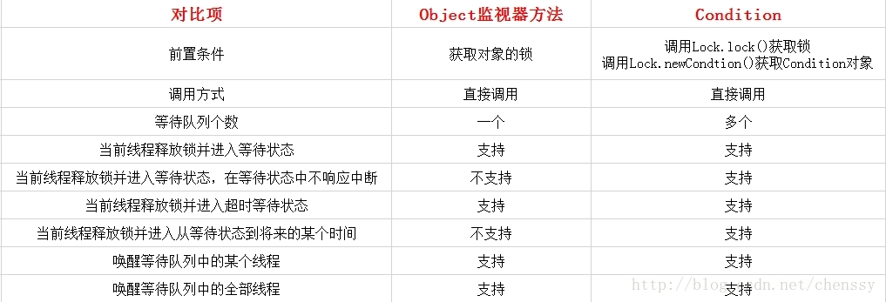

## J.U.C重入锁: Condition

在没有Lock之前, 我们使用`synchronized`来控制同步, 配合Object的wait(), notify()方法可以实现线程间的通信, 也就是等待/通知模式。在JDK5之后, Java提供了Lock接口, 相对于`Synchronized`而言, Lock也提供了条件`Condition`, 对线程的等待, 唤醒操作更加详细灵活。下图是Condition与Object的监视器方法的对比:



Condition提供一系列方法来阻塞和唤醒线程:

- **await():** 造成当前线程在接到信号或被中断之前一直处于等待状态。
- **await(long time, TimeUnit unit):** 造成当前线程在接到信号、被中断或到达指定等待时间之前一直处于等待状态.
- **await(long nanosTimeout):**  造成当前线程在接到信号, 被中断或到达指定等待时间之前一直处于等待状态。返回值表示剩余时间, 如果在nanosTimesout之前唤醒, 那么返回值 = nanosTimeout - 消耗时间, 如果返回值 <= 0, 则可以认定它已经超时了。
- **awaitUninterruptibly():** 造成当前线程在接到信号之前一直处于等待状态。**要注意的是: 该方法对中断不敏感。**
- **awaitUntil(Date deadline):** 造成当前线程在接到信号、被中断或到达指定最后期限之前一直处于等待状态。如果没有到指定时间就被通知，则返回true，否则表示到了指定时间，返回返回false。
- **signal():** 唤醒一个等待线程。该线程从等待方法返回前必须获得与Condition相关的锁。
- **signalAll():** 唤醒所有等待线程。能够从等待方法返回的线程必须获取与Condition相关的锁。

Condition为线程提供了更为灵活的等待/通知模式, 线程在调用await()方法后执行挂起操作, 直到线程等待的某个条件为真时才会被唤醒。

> Condtion必须要配合锁一起使用, 因为对共享状态变量的访问发生在多线程环境下, 一个Condition的实例必须与一个Lock绑定, 因此Condition一般都是作为Lock的内部实现。

### Condition实现分析

首先获取一个Condition必须要通过Lock的newCondition()方法。 这个方法是在Lock中的一个Sync内部类定义的。

```java
abstract static class Sync extends AbstractQueuedSynchronizer {
    ...

    final ConditionObject newCondition() {
        return new ConditionObject();
    }
}
```
Condition是一个接口, ConditionObject是它的实现类。而ConditionObject定义在AQS的一个内部类:

```java
public abstract class AbstractQueuedSynchronizer
    extends AbstractOwnableSynchronizer
    implements java.io.Serializable {

...

public class ConditionObject implements Condition, java.io.Serializable { ... }

}
```

##### 1.1 等待队列

每个Condition对象都包含一个FIFO队列, 该队列是Condtion对象通知/等待功能的关键。在队列中每一个节点都包含一个线程引用, 该线程就是在Condition对象上等待的线程。
```java
public class ConditionObject implements Condition, java.io.Serializable {
    private static final long serialVersionUID = 1173984872572414699L;

    //头节点
    private transient Node firstWaiter;
    //尾节点
    private transient Node lastWaiter;

    public ConditionObject() {
    }

    /** 省略方法 **/
}
```

从上面的代码可以看出Condition拥有首节点(firstWaiter), 尾结点(lastWaiter)。当前线程调用await()方法, 将当前线程构造成一个节点(Node), 并将节点加入该队列的队尾。


Node里面包含了当前线程的引用。Node定义与AQS的CLH同步队列的节点使用的都是同一个类(`AbstractQueuedSynchronizer.Node`静态内部类)。

Condition的队列结构比CLH队列的结构简单些, 新增过程较为简单。只需要将原尾节点的nextWaiter指向新增节点, 然后更新lastWaiter即可。

##### 1.2 通知

调用Condition的signal()方法, 将会唤醒在等待队列中等待最长时间的节点(调节队列的首节点), 在唤醒节点前, 会将节点移到CLH同步队列中。

```java
 public final void signal() {
    //检测当前线程是否为拥有锁的独
    if (!isHeldExclusively())
        throw new IllegalMonitorStateException();
    //头节点，唤醒条件队列中的第一个节点
    Node first = firstWaiter;
    if (first != null)
        doSignal(first);    //唤醒
}
```

该方法首先会判断当前线程是否已经获得锁, 这是前置条件。然后唤醒条件队列中的头节点。

`doSigal(Node first)`: 唤醒头节点

```java
private void doSignal(Node first) {
    do {
        //修改头结点，完成旧头结点的移出工作
        if ( (firstWaiter = first.nextWaiter) == null)
            lastWaiter = null;
        first.nextWaiter = null;
    } while (!transferForSignal(first) &&
            (first = firstWaiter) != null);
}
```

doSignal(Node first)主要是做两件事: 
1. 修改头节点
2. 调用`transferForSignal(Node first)`方法将节点移动到CLH队列中。

```java
final boolean transferForSignal(Node node) {
    //将该节点从状态CONDITION改变为初始状态0,
    if (!compareAndSetWaitStatus(node, Node.CONDITION, 0))
        return false;

    //将节点加入到syn队列中去，返回的是syn队列中node节点前面的一个节点
    Node p = enq(node);
    int ws = p.waitStatus;
    //如果结点p的状态为cancel 或者修改waitStatus失败，则直接唤醒
    if (ws > 0 || !compareAndSetWaitStatus(p, ws, Node.SIGNAL))
        LockSupport.unpark(node.thread);
    return true;
}
```

整个通知的流程如下:

1. 判断当前线程是否已经获取了锁, 如果没有获取则直接抛出异常, 因为获取锁为通知的前置条件。
2. 如果线程已经获取了锁, 则将唤醒条件队列的首节点
3. 唤醒首节点是先将条件队列中的头节点移出, 然后调用AQS的enq(Node node)方法将其安全的移到CLH同步队列中
4. 最后判断如果该节点的同步状态是否为Cancel, 或者修改状态为Signal失败时, 则直接调用LockSupport唤醒该节点的线程。

### Condition实现生产者消费者

我们利用Condition实现生产者消费者, 跟`synchronized`, `wait()`, `notifyAll()`方法类似:

```java
public class ConditionExample {

    private final static ReentrantLock lock  = new ReentrantLock();

    private final static Condition condition = lock.newCondition();

    private static int data = 0;

    private static volatile boolean noUse = true;

    public static void main(String[] args) {
        new Thread(() -> {
            while (true) {
                build();
            }
        }).start();
        for (int i = 0; i < 2; i++) {
            new Thread(() -> {
                while (true) {
                    userData();
                }
            }).start();
        }
    }

    private static void build() {
        try {
            lock.lock(); // 相当于synchronized
            // 没有使用, 就不能自增
            while (noUse) {
                condition.await(); // 相当于monitor.wait()
            }
            data++;
            Optional.of("P: " + data).ifPresent(System.out::println);
            TimeUnit.SECONDS.sleep(1);
            // 表示数据已经生产了, 还没有被消费, 所以通知线程B, 可以消费
            noUse = true;
            condition.signalAll();// 想当于monitor.notify()
        } catch (InterruptedException e) {
            e.printStackTrace();
        } finally {
            lock.unlock(); // 相当于 release synchronized
        }
    }

    private static void userData() {
        try {
            lock.lock();
            // 如果数据被消费了, 被打印了
            while (!noUse) {
                condition.await();
            }
//            TimeUnit.SECONDS.sleep(1);
            Optional.of("C: " + data).ifPresent(System.out::println);

            // 数据已经被使用了, 通线程A可以继续生产
            noUse = false;
            condition.signalAll();
        } catch (InterruptedException e) {
            e.printStackTrace();
        } finally {
            lock.unlock();
        }
    }
}
```