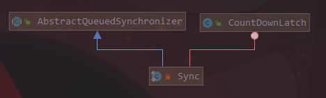

## J.U.C并发工具类: CountDownLatch

在提升篇的设计模式中, 我们了解CountDown设计模式。在JUC包下早已实现这种方式, 那就是`CountDownLatch`。

> `CountDownLatch`所描述的是: 在完成一组正在其他线程中执行的操作之前, 它允许一个或多个线程一直等待。

`CountDownLatch`是通过一个计数器来实现的, 当我们在new CountDownLatch对象时需要传入计数器值, 该值就表示了线程的数量。每当一个线程完成自己的任务后, 计数器的值就会减1。当计数器的值变为0时, 就表示所有的线程都完成了任务, 然后就可以恢复等待的线程继续执行。

### CountDownLatch实现分析

CountDownLatch结构如下:



CountDownLatch内部依赖Sync实现, 而Sync继承AQS。CountDownLatch仅仅提供了一个构造方法: `CountDownLatch(int count)`

```java
/**
    * Constructs a {@code CountDownLatch} initialized with the given count.
    *
    * @param count the number of times {@link #countDown} must be invoked
    *        before threads can pass through {@link #await}
    * @throws IllegalArgumentException if {@code count} is negative
    */
public CountDownLatch(int count) {
    if (count < 0) throw new IllegalArgumentException("count < 0");
    this.sync = new Sync(count);
}
```

> 通过内部类Sync可以清楚的发现, CountDownLatch是采用共享锁来实现的。

##### 1. await() & countDown()

`CountDownLatch`提供`await()`方法来使当前线程在锁存器倒计数变成0之前一直等待, 除非线程被中断:

```java
public void await() throws InterruptedException {
    sync.acquireSharedInterruptibly(1);
}
```

> await()方法内部也是调用sync的方法

`CountDownLatch`提供`countDown()`方法递减锁存器的计数, 如果计数减到0, 则释放所有等待的线程:

```java
public void countDown() {
    sync.releaseShared(1);
}
```

### 应用

`CountDownLatch`的应用场景还是很多的, **如果在某一系列的串行化操作中, 发现中间某个部分是可并行化的, 那么我们就可以用并行化的方式去做提高处理速度, 最终在串行化, 那么CountDownLatch就可以使用了。**

> 例如: 我们从前端或者DB中获取一批数据, 通过线程池对这批数据进行统一处理后, 需要反馈最终的处理结果。就可以使用`CountDownLatch`

```java
public class CountDownLatchExample1 {
    private static Random random = new Random(System.currentTimeMillis());

    private static ExecutorService executor = Executors.newFixedThreadPool(2);

    private static final CountDownLatch latch = new CountDownLatch(10);

    public static void main(String[] args) throws InterruptedException {
        //1. 获取数据
        int[] data = query();
        //2. 利用数据进行处理
        for (int i = 0; i < data.length; i++) {
            executor.execute(new SimpleRunnable(data, i));
        }
        //3.

        // executor的shutdown()方法只会在线程池空闲的时候才会中断, 也就是说shutdown()其实也是异步方法。不能用这种方式来控制线程执行的顺序
//        executor.shutdown();

        latch.await();
        System.out.println("all of work finish done.");

    }

    static class SimpleRunnable implements Runnable {

        private final int[] data;

        private final int index;

        SimpleRunnable(int[] data, int index) {
            this.data = data;
            this.index = index;
        }

        @Override
        public void run() {
            try {
                Thread.sleep(random.nextInt(2000));
            } catch (InterruptedException e) {
                e.printStackTrace();
            }
            int value = data[index];
            if (value % 2 == 0) {
                data[index] = value * 2;
            } else {
                data[index] = value * 10;
            }

            System.out.println(Thread.currentThread().getName() + " finished.");

            // 每次执行完任务, 就countDown()
            latch.countDown();
        }
    }

    private static int[] query() {
        return new int[]{1, 2, 3, 4, 5, 6, 7, 8, 9, 10};
    }
}
```


