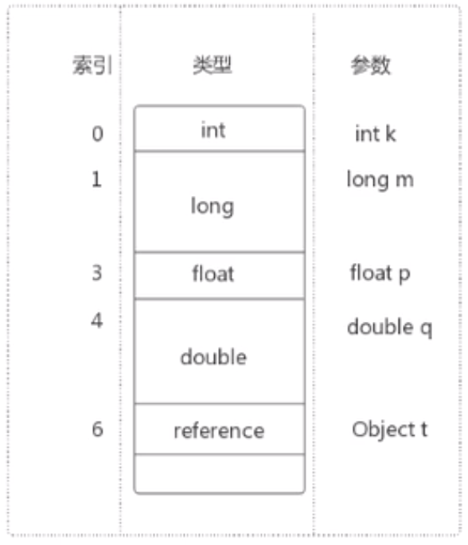
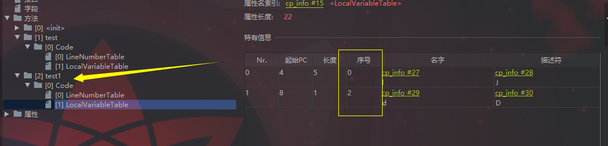

## Java虚拟机栈--栈帧

> 栈帧的内部结构

- **局部变量表(Local Variables)**

- **操作数栈(Operand Stack)**

- **动态链接(Dynamic Linking)**

- 方法返回地址

- 附加信息


### 2. 局部变量表

**局部变量表**的本质其实就是一个整型数组, 主要用于存储方法参数和定义在方法内的局部变量。包括基本数据类型, 对象引用地址。

**局部变量表所需的容量大小是在编译期就确定下来的。**, 所以在方法执行期间是不会改变局部变量表的大小。(可以理解为数组是固定大小的, 无法扩容)

**局部变量表中的变量只能在当前方法调用中有效。**

我们对下面的代码进行编译:

```java
public class LocalVariables {

    public void test(byte b) {
        int num = 10;
        String str = "Hello";
        System.out.println(str);
    }
}
```

> - 通过 `javap -v LocalVariables.class`命令查看字节码文件, 可以看到对应栈帧的局部变量表; 

```java
 LocalVariableTable:
        Start  Length  Slot  Name   Signature
            0      14     0     b   B
            3      11     1   num   I
            6       8     2   str   Ljava/lang/String;
```

我们对上面的字节码进行解释:

- `Start`表示变量定义的字节码指令位置, 也就是说`byte b`变量是在字节码指令0的位置定义的; 换句话说, 表示这个变量的作用域生效位置

- `Length`表示这个变量到哪个字节码指令位置 作用域结束;

    > 针对`Start`, `Length`的意思, 其实很好理解。 例如, 变量num, 它是从字节码指令地址3开始定义的, 也就是从3往后, num的作用域才开始生效, 3前面是无法调用num变量; 而整个代码的字节码指令长度是14, 所以变量num的作用域范围就是从3开始直接到14, 总共有长度11的字节码偏移量。

- `Slot`表示该变量占用的局部变量表的槽位置, 可以理解为数组的下标。 例如, num变量所在局部变量表中的位置就是1。(**要注意的是, 如果不是静态方法, 那么第一个槽位置, 也就是0所在的位置, 存储的是`this`当前对象的引用变量**)

- `Name`表示变量名称;

- `Signature` 表示变量的类型;
    - B -> byte; 
    - I -> int, 
    - L -> 表示类描述符, 表示这是一个类; LLjava/lang/String就表示类型String;
    - [ -> 数组类型; [I就表示 int[];


> - IDEA上安装jclasslib byte viewcoder插件, 也可以看到字节码文件信息


#### 2.1 变量槽Slot

局部变量都是存放在局部变量数组中, 从index0开始, 而局部变量表最基本的存储单元是Slot(变量槽)。

**32位以内的类型只占用一个`slot`, 64位的类型(long, double)占用两个slot。**

> byte, short, char, float在存储前会被转换为int, boolean也被转换为int, 0表示false, 非0表示true;

Slot存储结构如下图:



示例代码:

```java
public static void test1() {
    long l = 10l;
    double d = 2.5;
}
```

局部变量表为:



我们可以看到, long和double类型都占用两个slot, 而且会取最前的序号作为当前变量的槽。long l -> 0 (0, 1); double d -> 2 (2, 3);

JVM会为局部变量表中的每一个slot分配一个访问索引, 通过这个索引就可以访问局部变量表中指定的变量值。

**我们上面的示例代码都是静态方法, 它的slot index0的位置就是第一个变量值所在的位置, 但是如果是实例方法, index0则是this。**

实例方法:

```java
public void test2() {
    int num = 10;
    System.out.println("Hello");
}
```

局部变量表为:


> **这也是为什么静态方法中不能引用this, 因为静态方法所对应的栈帧中的局部变量表不存在this。**

从上图可以看到this表示的就是当前类的实例变量, 而静态方法在类加载阶段就已经加载到内存当中了, 此时实例还没有被创建, 所以也就不存在this。

栈帧中的局部变量表中的槽位是可以重复利用的, 如果一个局部变量过了作用域, 那么之后申明的变量就可能会复用过期的局部变量的槽位, 从而达到节省资源的目的。

```java
private void test3() {
    int a = 0;
    {
        int b = 0;
        b = a+1;
    }
    //变量c使用之前以及经销毁的变量b占据的slot位置
    int c = a + 1;
}
```

上面代码对应的栈帧中局部变量表只会有3个slot, 因为变量b的作用域是

```java
{
    int b = 0;
    b = a+1;
}
```

index0: this; index1: a; 变量c重复使用了b的索引号。


### 3. 操作数栈(Operand Stack)

**操作数栈**是存在于栈帧中的一种栈结构。又被称之为表达式栈。

**在执行方法过程中, 根据字节码指令, 往操作数栈中写入数据或弹出数据, 即入栈(push)或出栈(pop)。**

> 一般情况下, 字节码指令中push操作就是入栈操作, 例如`bipush`。

例如下面代码:

```java
public class OperandStack {

    public void test() {
        int i = 15;
        int j = 8;
        int k = i + j;
    }

}
```

上面代码的字节码指令为:

```java
 0 bipush 15
 2 istore_1
 3 bipush 8
 5 istore_2
 6 iload_1
 7 iload_2
 8 iadd
 9 istore_3
10 return
```

我们结合局部变量表, 程序计数器(PC寄存器), 操作数栈来分析上面的字节码指令。

- `0 bipush 15`: 此时线程执行指令0地址, 将8压入操作数栈(栈顶15), PC寄存器(0), 局部变量表的0位是this;

    


- `2 istore_1`: 此时线程执行指令2地址, 将15从操作数栈中出栈, PC寄存器(2), 将8存入局部变量表的slot index1;

    

- `3 bipush 8`: 这个操作跟上面一样

- `5 istore_2`: 这个操作跟上面一样

    

- `6 iload_1`, `7 iload_2`: 从局部变量表中, 把索引为1和2的数据取出来, 放到操作数栈中;

    

- `8 iadd`: 将操作数栈中的两个数, 通过执行引擎执行相加操作, 并将iadd操作结果23出栈;

    

- `istore_3`: 将23存储在局部变量表索引为3的位置上。

    


通过上面非常详细的字节码分析, 其实可以很容易把之前学习到的知识串起来了。PC寄存器保存线程执行的字节码指令地址, 局部变量表存储局部变量数据, 操作数栈主要是保存局部变量的一个临时区域。

#### 3.1操作数栈特点

- **操作数栈, 主要用于保存计算过程的中间结果, 同时作为计算过程中变量临时的存储空间。**

> 操作数栈并不是采用访问索引的方式来进行数据访问的, 只能通过入栈和出栈操作, 来完成一次数据访问。

- 如果被调用的范法带有返回值, 那么返回值会被压入当前栈帧的操作数栈中。

- Java虚拟机的解释引擎是基于栈的执行引擎, 其中的栈就是指操作数栈。

### 4. 动态链接(Dynamic Linking)

#### 4.1 运行时常量区

> JDK7以及之后版本的 JVM 已经将**运行时常量池**从**方法区**移到了**Java堆(Heap)中开辟一块区域存放运行时常量池**。

**为什么需要常量池?**

运行时常量池的作用, 就是为了提供一些符号和常量, 便于指令的识别。


每一个栈帧内部都包含一个纸箱运行时常量池`Constant Pool`或该栈帧所属方法的引用。包含这个引用的目的就是为了支持当前方法的代码可以实现动态链接。比如`invokedynamic`指令。

在Java源文件被编译成字节码时, 所有的变量和方法引用都作为符号引用保存在class字节码文件的常量池里。

比如: 描述一个方法调用了另外的其他方法时, 就是通过常量池中指向方法的符号引用来表示的。那么**动态链接的作用就是将这些符号引用(#)最终转换为调用方法的直接引用。**


#### 4.2 方法的调用

在JVM中, 将**符号引用转换为调用方法的直接引用**与**方法的绑定机制**相关。

- 静态链接

    当一个字节码文件被装载进JVM内部时, 如果被调用的目标方法在编译器可知, 且运行期间保持不变时。这种情况下将调用方法的符号引用转换为直接引用的过程称为静态链接。

- **动态链接**

    如果调用的方法在编译器无法被确定下来。也就是说, 只有在程序运行期间将符号引用转换为直接引用, 由于这种引用转换过程具备动态性, 所以称为动态链接。

对应的方法绑定机制为: 早期绑定, 晚期绑定。

> 绑定的意思就是一个字段, 方法或者类在符号引用被替换为直接引用的过程。仅仅会发生一次。

- 早期绑定

    早期绑定就是指被调用的目标方法如果在编译期可知，且运行期保持不变时，即可将这个方法与所属的类型进行绑定，这样一来，由于明确了被调用的目标方法究竟是哪一个，因此也就可以使用静态链接的方式将符号引用转换为直接引用。

- **晚期绑定**

    如果被调用的方法在编译期无法被确定下来，只能够在程序运行期根据实际的类型绑定相关的方法，这种绑定方式也就被称之为晚期绑定。

> 对于Java语言来说, 支持封装, 继承和多态等面向对象的特性, 这一类的编程语言具备多台特性, 那么自然就具备早期绑定和晚期绑定两种绑定方法。

#### 4.3 虚方法和非虚方法

非虚方法: 如果方法在编译期间就确定了具体的调用版本, 这个版本在运行时是不可变的。这样的方法称为非虚方法。

> **静态方法, 私有方法, final方法, 实例构造器(实例已经确定, this()表示本类的构造器), super调用父类方法都是非虚方法。**

那么其他所有体现多态特性的方法都是**虚方法**。

也就是说, 类的继承, 方法的重写, 接口的实现其实都是多态的体现, 也是虚方法。

**虚方法表:**

在面向对象编程中, 会很频繁的使用动态分派, 如果每次都需要动态分派的过程中要重新在类的方法元数据中搜索合适的目标就会大大影响执行效率。

所以**为了提高性能, JVM采用在类的方法区创建一个虚方法表(`virtual method table`), 通过索引的方式快速查找合适的方法。**

### 5. 方法返回地址(Return Address)

这里不做详细的介绍, 简单的了解下。

方法返回地址存放的时调用该方法的程序计数器的值。

程序计数器的值是存放指令地址的, 而方法退出后需要返回到该方法被调用的位置, 所以需要记录调用这个方法时的指令位置。
