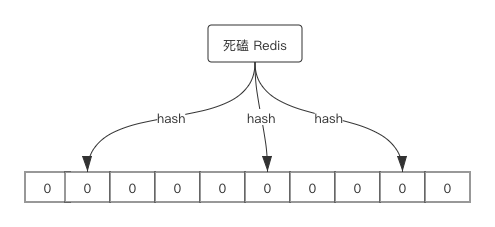
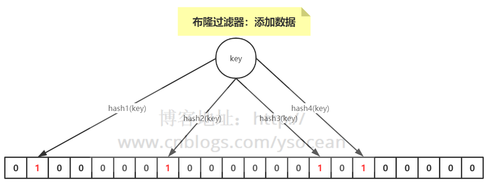
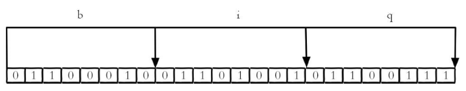
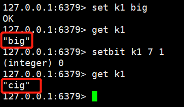
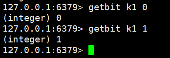
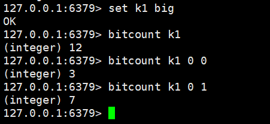

## Redis-布隆过滤器(Bloom Filter)

引入布隆过滤器的目的一般是为了解决缓存穿透的问题, 这个我们之前说过, 这个看这篇文章 [ Redis-缓存击穿与雪崩](database/Redis/interview/redis_highconcurrency.md)

当然布隆过滤器不仅仅是解决缓存穿透问题, 一般对于大数据量集合, 需要快速且准确的判断某个数据是否在集合中, 并且不占用内存, 布隆过滤器就是很好的选择。

### 1. 布隆过滤器原理

布隆过滤器可以简单的理解为两个重要部分组成:

- 很长的二进制向量或者是数组, 既然是二进制, 那么里面存放的要么是0, 要么是1, 但是初始默认都是0;

- 一组hash函数, 可以由用户自定义实现。



从上图可以很清晰的看出布隆过滤器的结构。

#### 1.1 添加数据

我们可以把布隆过滤器看成一个二进制数组, 当我们添加元素key时, 我们通过多个hash函数, 可以算出一个值, 然后根据这个值找到数组对应的下标, 并把其中位值改为1。

例如: hash1(key)=1, 那么下标1的位置置位1, hash2(key)=7, 那么下标7的位置置位1。



#### 1.2 判断元素是否存在

既然知道了如何添加元素, 那么当我们查询一个元素时, 同样是通过多个hash函数, 产生哈希值, 判断对应的位置是否都是1, 如果存在一个不是1的情况, 那么这个元素一定不存在布隆过滤器中。

但是**这个元素不一定存在于布隆过滤器中!!!** 

因为很可能存在多个元素, 经过hash函数所算出来的结果可能有重复的, 所以存在某个位置是其他数据通过hash函数置为1。

我们可以得到一个结论: **布隆过滤器可以判断某个数据一定不存在, 但是无法判断一定存在。**

#### 1.3 布隆过滤器的优缺点

优点:

- 二进制组成的数组, 占用内存很小, 所以插入和查询速度都足够快;

缺点:

- 随着数据的增加, 误判率也会增加, 因为所占用的二进制位越来越多, 很有可能其他数据的干扰;

- 无法删除数据。

### 2. Redis实现布隆过滤器

Redis本身提供: **`bitmaps`** 可以利用来实现布隆过滤器的效果。

> `bitmap`就是通过bit位标识某个元素对应的值或者状态。

我们知道计算机是以二进制位作为底层存储的基础单位, 一个字节等于8位。

比如: "big", 字符串是由三个字符组成, 这三个字符对应的ASCII码为98, 105, 103, 对应的二进制存储如下:



在Redis中, bitmaps提供了一套命令来操作类似上图字符串中的每一位。

#### 2.1 设置值

```shell

// key: 表示键, offset表示字节位置, value表示值(0/1)
setbit key offset value
```

> 要注意的是, 
>
> - bitmap本质是字符串, 使用type命令对bitmap的相关key进行操作, 可以看出结果为"string", 因此key最大不能超过512MB;
>
>- offset是偏移量, 使用大的`offset`的setbit操作的话,内存分配可能造成Redis服务器阻塞



我们可以看到, 将第7位设置为1, 那么原来的字符"b", 就变成了"c", 因为字符"c"的二进制为0110 0011

#### 2.2 获取值

```shell
gitbit key offset
```



#### 2.3 获取位图指定范围值为1的个数

```shell

// 注意这里的start, end不是位数组下标, 而是字节的个数, 也就是每8位统计1的个数; 
// 如果不指定start, end, 那就是获取全部值为1的个数
bitcount key [start end]
```




### 3. 客户端实现布隆过滤器

Redis底层是通过bitmap来实现布隆过滤器, 在java层面 也已经封装了布隆过滤器。

- Redisson

    Redisson其实也是基于Redis实现的布隆过滤器, 底层也就是bitmaps的实现。 既可以使用单节点Redis, 也可以使用Redis集群

    ```java
    public static void main(String[] args) {
        Config config = new Config();
        // redis单机
        config.useSingleServer().setAddress("redis://192.168.14.104:6379");
        config.useSingleServer().setPassword("123");

        /*
        // redis集群
        config.useSentinelServers()
            .addSentinelAddress("127.0.0.1:6369","127.0.0.1:6379", "127.0.0.1:6389")
            .setMasterName("masterName")
            .setPassword("password").setDatabase(0);
        */
        //构造Redisson
        RedissonClient redisson = Redisson.create(config);

        RBloomFilter<String> bloomFilter = redisson.getBloomFilter("phoneList");
        //初始化布隆过滤器：预计元素为100000000L,误差率为3%
        bloomFilter.tryInit(100000000L,0.03);
        //将号码10086插入到布隆过滤器中
        bloomFilter.add("10086");

        //判断下面号码是否在布隆过滤器中
        System.out.println(bloomFilter.contains("123456"));//false
        System.out.println(bloomFilter.contains("10086"));//true
    }
    ```

- guava工具

    这个google提供的由java实现的布隆过滤器, 不依赖于Redis, 使用方式如下:

    ```java
    public static void main(String[] args) {
        BloomFilter<String> bloomFilter = BloomFilter.create(Funnels.stringFunnel(Charsets.UTF_8),100000,0.01);

        bloomFilter.put("10086");

        System.out.println(bloomFilter.mightContain("123456"));
        System.out.println(bloomFilter.mightContain("10086"));
    }
    ```
