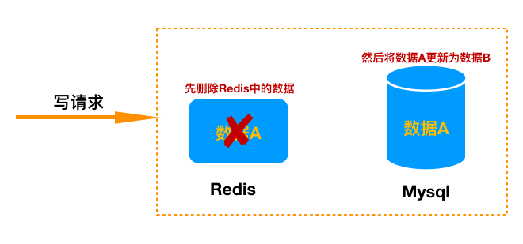
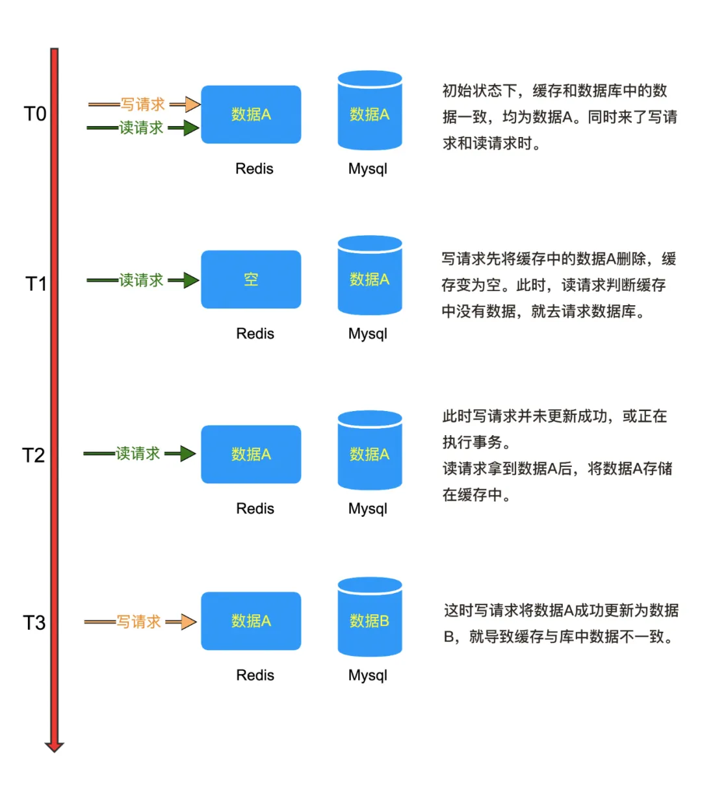
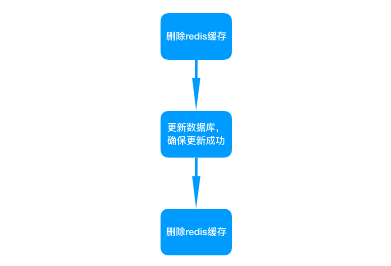

## Redis-缓存与数据库双写一致性

在实际生产场景中, 为了避免大量请求同时落到数据库上导致数据库层崩溃, 所以采用数据库+缓存是最基本的操作。

除了之前提到的, 高并发场景中redis服务问题, 还有最基本的问题就是如何操作缓存。

对于读取数据, 比较简单; 但是对于写操作, 到底是先写库还是先写缓存, 这点需要去探究。从而延伸出来的问题就是**缓存与数据库双写一致性问题**。

### 1.Cache Aside Pattern

**旁路缓存策略(`Cache Aside Pattern`)** 是基本和常见的缓存数据库读写模式, 使用方式有两种情况, 一读一写:

- 基本读取方式;

- 先更新数据库, 后删除缓存。

#### 1.1 基本读取方式

这部分很简单: 先读缓存, 缓存中没有数据的话就去数据库读取, 然后在存入缓存中, 同时返回数据。

#### 1.2 先更新数据库, 后删除缓存

对于这种方案, 可能会有人存在疑问, 为什么要删除缓存而不是更新缓存?

- **频繁更新, 浪费资源**

    如果在某一段时间内, 频繁修改数据库中的数据, 那么缓存也必须跟着修改, 就会导致需要浪费一部分资源去操作缓存;

- **缓存数据计算复杂**

    如果缓存中的数据, 需要多张表联合计算出结果, 那么每次修改数据, 都需要去更新缓存, 在计算一次, 浪费的资源更多;

- **两种情况都具备**

    如果上面两种情况都存在, 那么问题更大, 不但频繁修改, 同时缓存数据还要经过复杂计算。

所以更新缓存的方式不可行。

**按照上面的思路, 如果我们先更新数据库, 再删除缓存。**在这种情况下, 读请求过来, 发现redis中没有数据, 就会去数据库读取, 然后写入缓存。这是一种懒加载方式, 只有缓存被需要的时候才会加载。

但是仍然存在问题:

1. 不适合高并发的场景

    这种最基本的`Cache Aside Pattern`, 在一般情况下都是没问题的, 但是不适合在高并发场景下, 因为高并发的请求下, 很可能在我删除缓存之后, 大量的请求过来, 还没来得及返回缓存, 导致请求都落到了数据库层, 很可能导致数据库的崩溃。

2. 如果操作缓存失败, 导致数据库更新成功, 但是缓存中仍然是旧数据, 出现数据不一致情况。

### 2. 双写一致方案

我们之前介绍了`Cache Aside Pattern`方案在数据库与缓存双写问题。那么就需要一定的解决方案。

#### 2.1 先删除缓存, 后更新数据库

这种方案很明显是不行的, 因为同样存在更新数据库失败, 虽然不会出现Redis与数据库数据不一致问题, 但是数据没有更新成功依然是很大的问题。我们先看下图:

#### 2.2 缓存延时双删策略

如果并发量较大的场景中, 同时来了两个请求, 一个写请求, 一个读请求

写请求先删除Redis中的数据, 然后去数据库更新数据;

读请求判断redis中没有数据, 然后又去请求数据库, 拿到数据后写入缓存中。

但此时写请求还没来得及完全更新数据库中的数据, 导致读请求拿到了旧数据写入缓存, 然后写请求将数据库更新成功, 那么此时又出现了了缓存与数据库数据不一致问题。

在高并发场景中这样的问题可以说经常出现, 它的解决方案就是**延时双删策略**。

写请求过来先把Redis缓存删除, 等数据更新成功后, 再次把Redis缓存删掉。

这种方案的优点就在于处于读取速度很快, 但是会出现脏读问题。也就是仍然会出现部分读请求读取到旧数据。

#### 2.3 读写请求串行化

这个比较好理解, 因为串行化一定不会出现数据不一致问题, 但是它会导致系统的吞吐量降低, 只能通过增加机器来支持线上请求。