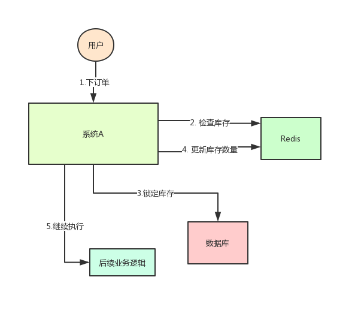
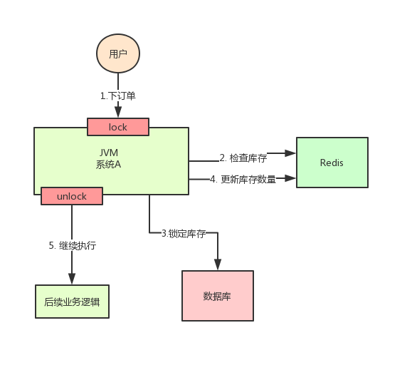
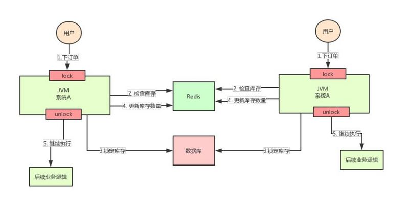
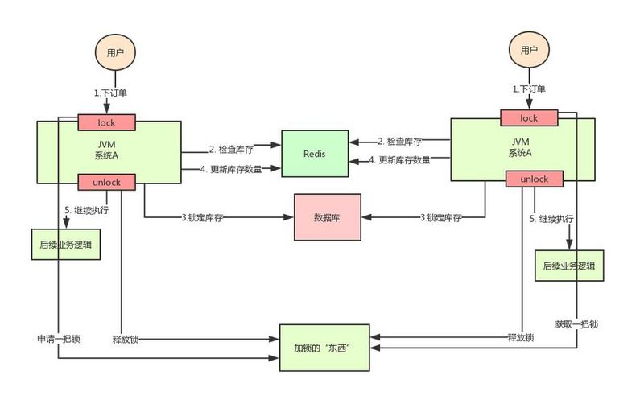

## Redis-分布式锁

### 1. 为什么要用到分布式锁

在多线程场景下, 为了保证一个代码块在同一时间只能由一个线程访问, 在Java中我们一般可以使用`synchronized`和`ReentrantLock`保证线程安全, 但是这实际上是一种本地锁, 只适用于单机环境。

在分布式架构中, 一个系统拆分成不同的服务部署在不同的服务器上, 那么如何保证不同节点的线程同步执行呢?

**分布式锁, 就是控制分布式系统之前互斥访问共享资源的一种方式。**

最经典的业务场景就是 **库存超卖问题**。

#### 1.1 单机环境

假设系统A是电商系统, 目前是单机部署, 系统中用户请求下订单, 但是在下订单之前肯定要先检查库存, 确保库存足够才能下单成功。

由于系统有一定的并发, 所以会预先将商品的库存保存在redis中, 用户下单的时候更新redis库存, 具体流程如下:



但是在某一时刻, 商品库存为1, 在并发请求的环境下, 两个请求同时到来就会产生问题, 请求一先锁定了库存还没来得及更新redis中的缓存库存, 此时请求二发现redis中的库存还是1, 就会继续执行订单操作, 导致库存超卖。

最简单的方式就是, 让检查库存, 更新数据库库存, 更新redis库存变成原子操作, 也就是加锁即可。



#### 1.2 集群环境

当并发量越来越大, 一台机器扛不住了, 现在要增加一台机器:



这样又会出现一个问题, 服务器集群必然会进行负载均衡, 所有的订单请求都是随机访问不同的服务器,
那么两个系统A部署在不同的服务中, 运行不同的JVM环境, 而`synchronized`和`ReentrantLock`是本地锁, 只支持本机线程安全的, 那么依然出现**库存超卖**。

所以要保证多台机器家的所是同一个锁, 就可以解决这个问题, 也就是分布式锁。

**分布锁的思路就是: 在整个系统中提供了全局, 唯一的锁资源, 每个系统需要获取锁和释放锁, 都统一去该资源中获取, 这样就可以获取同一把锁, 实现多个系统间的线程安全问题。**



### 2. 分布式锁设计

对于分布式的选项与设计一般要满足下面几个性质:

- **互斥性:** 同一时刻只能有一个线程持有锁;

- **可重入性:** 同一节点上的同一线程如果获取了锁之后能够再次获取锁;

- **锁超时:** 和JUC的锁一样支持超时, 防止死锁;

- **高性能和高可用:** 加锁和解锁需要高效, 同时保证高可用, 防止分布式失效;

- **阻塞和非阻塞:** 能够及时从阻塞状态中被唤醒

那么实现分布式锁的方案一般有三种 **Redis, Zookeeper, 数据库**。

本文章主要基于Redis实现分布式锁。

### 3. Redis分布式锁

#### 3.1 利用 setnx+expire 命令(不可行)

代码如下:

```java
public boolean tryLock_with_lua(String key, String UniqueId, int seconds) {
    String lua_scripts = "if redis.call('setnx',KEYS[1],ARGV[1]) == 1 then" +
            "redis.call('expire',KEYS[1],ARGV[2]) return 1 else return 0 end";
    List<String> keys = new ArrayList<>();
    List<String> values = new ArrayList<>();
    keys.add(key);
    values.add(UniqueId);
    values.add(String.valueOf(seconds));
    Object result = jedis.eval(lua_scripts, keys, values);
    //判断是否成功
    return result.equals(1L);
}
```

这种方式, `setnx`与`expire`是分开两步操作的, 不是原子操作, 如果很有可能导致执行完第一步, 第二步执行异常了, 锁无法过期。

一种改善访问就是利用`Lua`脚本来保证原子性(包含了setnx和expire两条指令)

#### 3.2 使用Lua脚本(包含setnx和expire两条指令)

代码如下:

```java
public boolean tryLock_with_lua(String key, String UniqueId, int seconds) {
    String lua_scripts = "if redis.call('setnx',KEYS[1],ARGV[1]) == 1 then" +
            "redis.call('expire',KEYS[1],ARGV[2]) return 1 else return 0 end";
    List<String> keys = new ArrayList<>();
    List<String> values = new ArrayList<>();
    keys.add(key);
    values.add(UniqueId);
    values.add(String.valueOf(seconds));
    Object result = jedis.eval(lua_scripts, keys, values);
    //判断是否成功
    return result.equals(1L);
}
```

#### 3.3 使用set key value [ex seconds][px milliseconds][NX|XX]命令 (可行)

Redis在2.6.12版本开始, 为set命令增加选项:

```shell
SET key value[EX seconds][PX milliseconds][NX|XX]
```

- EX seconds: 设定过期时间, 单位是秒

- PX milliseconds: 设定过期时间，单位为毫秒

- NX: 仅当key不存在时设置值

- XX: 仅当key存在时设置值

在java中也可以使用:

```java
public boolean tryLock_with_set(String key, String UniqueId, int seconds) {
    return "OK".equals(jedis.set(key, UniqueId, "NX", "EX", seconds));
}
```

#### 3.4 释放锁的实现

我们在获取锁的时候, 当业务代码执行完毕, 需要主动的释放锁, 而且只能获取锁的线程才能释放锁, 所以不能直接del key, 因为如果这样集群服务都可以任意进行解锁。

为了解决这个问题, 需要为**key设置一个value, 然后客户端要判断value是否是自己的, 才能释放锁。**


**这里还要注意的是是否保证保证value的唯一性?**

答案是肯定需要保证value的唯一性, 否则设置value的意义就不存在, 任何服务都能拿到value进行解锁了。

```java
public boolean releaseLock_with_lua(String key,String value) {
    String luaScript = "if redis.call('get',KEYS[1]) == ARGV[1] then " +
            "return redis.call('del',KEYS[1]) else return 0 end";
    return jedis.eval(luaScript, Collections.singletonList(key), Collections.singletonList(value)).equals(1L);
}
```

#### 3.5 一般Redis分布式锁的问题

通过上面的方式, 我们可以利用redis实现分布式锁, 逻辑上是没有问题的, 但是实际开发中, 如果Reids是集群, 那么又会存在一个问题。

例如: 客户端A在Redis的master节点上拿到了锁, 但是这个加锁的key还没有同步到slave节点, master就发生故障了, 因为哨兵模式的存在, 导致slave节点升级为master节点, 其他客户端也可以获取相同的key的锁, 导致多个客户端都能过拿到锁资源。

所以针对Redis集群, 还有其他方案。

### 4. RedLock算法与Redisson实现

#### 4.1 RedLock算法

RedLock是基于Redis集群环境下的分布式锁实现算法, 原理如下:

假设有5个独立的Redis节点, **这些节点完全互相独立，不存在主从复制或者其他集群协调机制**:

1. 获取当前Unix时间, 单位是毫秒;

2. 依次尝试从5个实例, 使用相同的key和具有唯一性的value获取锁, 当向Redis请求获取锁时, 客户端应该设置一个网络连接和响应超时时间, 这个超时时间应该小于锁的失效时间。(**这里就相当于不断向Redis服务端发送心跳**), 这样如果Redis服务端已经挂掉了, 客户端应该尽快尝试从另一个Redis实例请求获取锁;

3. 客户端使用当前时间减去开始获取锁时间(也就是步骤1的Unix时间), 就可以得到获取锁使用的时间, **只有当大多数的Redis节点都获取到锁, 并且使用时间小于锁失效时间时, 锁才算获取成功。** (这里的大多是是N/2+1, N表示Redis节点个数, 例如: 5个Redis节点, 这里大多数就是3个节点);

4. 如果取到了锁，key的真正有效时间等于有效时间减去获取锁所使用的时间(步骤3计算的结果);

5. 如果因为某些原因，获取锁失败(没有在至少N/2+1个Redis实例取到锁或者取锁时间已经超过了有效时间), 客户端应该在所有的Redis实例上进行解锁(即便某些Redis实例根本就没有加锁成功，防止某些节点获取到锁但是客户端没有得到响应而导致接下来的一段时间不能被重新获取锁)。

其实RedLock算法还是比较复杂的, 但是对于Java来说, Redisson已经会redlock算法封装。

#### 4.3 Redisson实现

Redisson也是Java的客户端, Jedis是阻塞式I/O, 而Redisson底层使用Netty可以实现非阻塞IO, 而且Redisson也是封装了本地锁, 它继承了JUC的Lock接口, 所以我们可以像使用ReentrantLock一样使用Redisson。

1. 先引入POM依赖:

```xml
<dependency>
    <groupId>org.redisson</groupId>
    <artifactId>redisson</artifactId>
    <version>3.10.6</version>
</dependency>
```

2. 使用Redisson，代码如下(与使用ReentrantLock类似)

```java
// 1. 配置文件
Config config = new Config();
config.useSentinelServers()
        .addSentinelAddress("127.0.0.1:6369","127.0.0.1:6379", "127.0.0.1:6389")
        .setMasterName("masterName")
        .setPassword("password").setDatabase(0);
//2. 构造RedissonClient
RedissonClient redissonClient = Redisson.create(config);

//3. 设置锁定资源名称 还可以getFairLock(), getReadWriteLock() 实现公平锁和读写锁
RLock lock = redissonClient.getLock("redlock");
boolean isLock;
try {
    isLock = redLock.tryLock();
    // 500ms拿不到锁, 就认为获取锁失败。10000ms即10s是锁失效时间。
    isLock = redLock.tryLock(500, 10000, TimeUnit.MILLISECONDS);
    if (isLock) {
        //TODO if get lock success, do something;
    }
} catch (Exception e) {

} finally {
    // 无论如何, 最后都要解锁
    redLock.unlock();
}
```

Redisson中value的唯一性算法, 是利用**UUID+threadId**的方式。
```java
protected final UUID id = UUID.randomUUID();
String getLockName(long threadId) {
    return id + ":" + threadId;
}
```

Redisson内部的源码也是利用Lua脚本实现原子操作。

### 5. Redis分布式锁主从架构锁失效问题如何解决

这其实是个面试题, 只要看了上面的内容基本都可以答出来了。

使用`setnx+lua`命令, 或者`set key value ex seconds`  这种方式加锁只能作用一个Redis节点上, 即使利用哨兵, 也会出现主从节点切换导致的锁丢失情况。

所以一般有人问这个问题, 基本上就是回答RedLock算法, 或者Redisson实现。