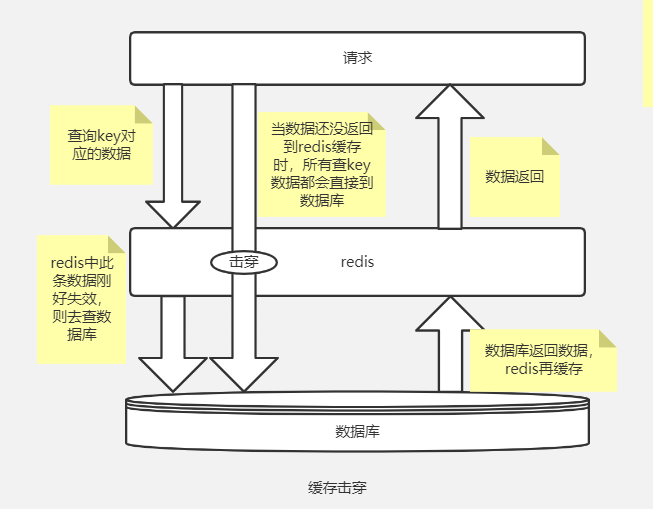
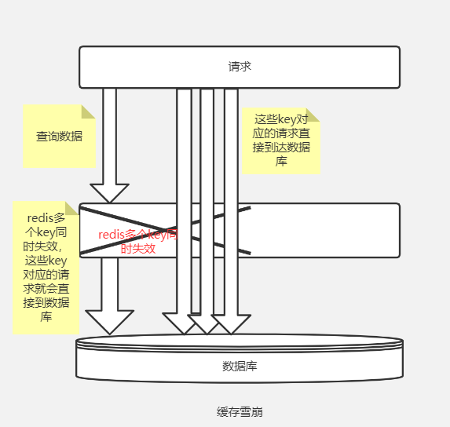

## Redis-缓存击穿与雪崩

在高并发的大型项目中, Redis作为缓存的使用应该是在常见不过的, 但是Redis在高并发场景下, 也会出现很大的问题, 导致整个服务的崩溃。

1. 缓存穿透

2. 缓存击穿

3. 缓存雪崩

### 1. 缓存穿透

缓存穿透的原因, 就是在请求数据时, 通过key在缓存层没有找到符合条件的数据, 导致大量的请求进入数据库层, 而数据库也找不到数据, 导致缓存层一直为空, 叫做**缓存穿透**。

**解决缓存穿透一般有两种方案:**

1. 既然缓存层和数据库都找不到数据, 那么可以把这个key对应的空对象加入缓存中, 这样每次请求缓存直接返回空对象即可, 一定程度上保障数据库的安全;

2. 利用**布隆过滤器**。布隆过滤器可以针对大数据量的, 键值进行处理。可以判断这个key一定不存在或者可能存在。而且判断速度很快。具体布隆过滤器可以查看这篇文章 [Redis布隆过滤器](database/Redis/interview/redis_bloomfilter.md)

### 2. 缓存击穿

缓存击穿其实跟缓存穿透很像, 都是根据key在缓存层找不到数据, 导致大量的请求到达数据库层。

一般我们认为, **缓存中的数据在某一时刻过期了, 导致大量用户请求到达数据层, 因为高并发的场景下, 可能数据库中的数据还没来得及返回, 已经有大量的请求落入了数据库, 导致数据库压力很大。称为缓存击穿**

**解决缓存击穿的问题一般也有两种:**

1. 对热点key不设置过期时间, 或者分配合理的过期时间, 避免同一时间失效;

2. 利用分布式锁, 保证对于每个key同时只有一个线程去查询后端的服务, 其他线程处于等待状态; 但是这样对分布式锁的访问压力较大。

### 3. 缓存雪崩

缓存系统发送故障或者崩溃, 导致大量的请求直接到达数据库, 而且无法返回缓存层, 就会导致数据层也会被大流量压垮, 这种级联式的服务故障,就是**缓存雪崩**。

我们之前提到的热点key问题, 就可能会导致redis服务崩溃, 大量的请求流入数据库, 从而也导致数据库的崩溃。

**解决缓存雪崩的方案有两种:**

1. 一般情况下, 解决缓存雪崩的问题就是保证缓存系统的高可用, 所以可以把Redis缓存部署成高可用集群;

2. 也可以在客户端层采用限流降级的方式, 对大并发流量进行限制;

3. 可以通过数据预热的方式将可能大量访问的数据提前加载到缓存, 并为数据数据设置不同的过期时间, 让缓存失效的时间尽量均匀,不至于同一时间全部失效。

