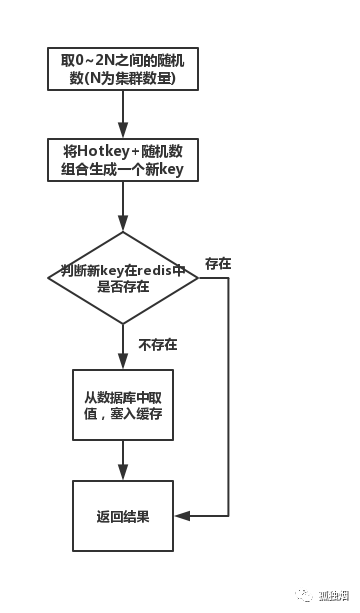

## Redis-热点Key问题

### 1. 热点问题的原因

热点问题产生的原因一般有两种:

1. 大量用户的请求导致消费的数据远大于生产的数据, 比如: 热卖商品, 热点新闻等等。

    - 一般读多写少的场景都有可能出现热点问题, 因为需求量过大, 导致

2. 大量的请求都集中在单Server上, 超过单个服务的性能极限。

    - 在服务端读取数据进行访问时, 虽然是进行Redis集群, 把所有数据进行分片, 但是可能存在对某一Server上的key进行访问过于频繁, 超过了服务极限, 导致热点key问题。

### 2. 热点key的危害

1. 由于大量的请求, 产生热点key会导致某一主机上超过物理网卡的上线, 从而导致其他服务无法进行;

2. 热点key大量集中在单一Server上，导致Redis服务崩溃;

3. 当缓存服务崩溃后, 此时再有请求产生, 就会直接请求DB, 由于DB本身性能较弱, 在面临大量请求时很容易发生**缓存穿透**, 进一步导致DB服务雪崩。

### 3. 如何发现热点Key

1. 根据业务场景进行预估哪些是热点key;

    这个方案是可行的, 缺点就是并非所有业务都可以预估热点key。

2. 在客户端进行收集;

    在操作redis之前, 先对key进行统计。如果超过某个值, 就发送警报信息; 缺点就是对业务代码造成入侵。

3. 用Redis自带命令;

    - `monitor`命令, 可以实时抓取redis服务器接收的命令, 然后分析热点key;但是该命令在高并发的条件下, 可能会导致内存增加, 反而降低了redis的性能;

    - `hotkeys`参数, redis4提供了redis-cli的热点key发现功能; 在执行redis-cli时加上`-hotkeys`选项,可以统计出热点key的信息。但是该参数在执行的时候, 如果key比较多, 执行起来比较慢。

### 4. 如何解决热点key

一般情况下我会采用两种方案解决。

#### 4.1 利用二级缓存

利用`ehcache`, 或者`HashMap`。在发现热点key之后, 把热点key加载到JVM中。

这样的话, 热点key就直接从JVM获取, 不会达到redis层。

> 假设此时有十万个针对同一个key的请求过来,如果没有本地缓存，这十万个请求就直接怼到同一台redis上了。现在假设，你的应用层有50台机器，OK，你也有jvm缓存了。这十万个请求平均分散开来，每个机器有2000个请求，会从JVM中取到value值，然后返回数据。避免了十万个请求怼到同一台redis上的情形。

#### 4.2 备份热点key

这个方案也比较简单, 就是不要让热点key都存在同一台redis。我们把热点key在多个redis上都存一份, 相当于做负载均衡。当请求进来时, 随机选取一台redis服务进行访问取值。

一般步骤如下:

### 5. 实际开发运用

在实际开发中, 一般不是特定的活动场景,这种热点key发生的事件可能是随机的。所以不可能监控发现热点key, 然后在通知开发人员手动操作。

所以在实际项目中, 一般是监控发现热key, 然后程序自动处理。

实现并不难, 一般只有两步:

1. 监控热点key;

2. 通知系统自动处理。

在监控热点key, 可以采用上面的3种方案。我采用方案就是在java代码层面, 对jedis进行改写。每次对key值访问请求时, 就把key访问事件异步上传到监控系统, 方便进行**热点探测**。

当key访问事件达到一定阈值时, 就利用二级缓存进行处理。把这个key作为热点key, 进行本地缓存。
