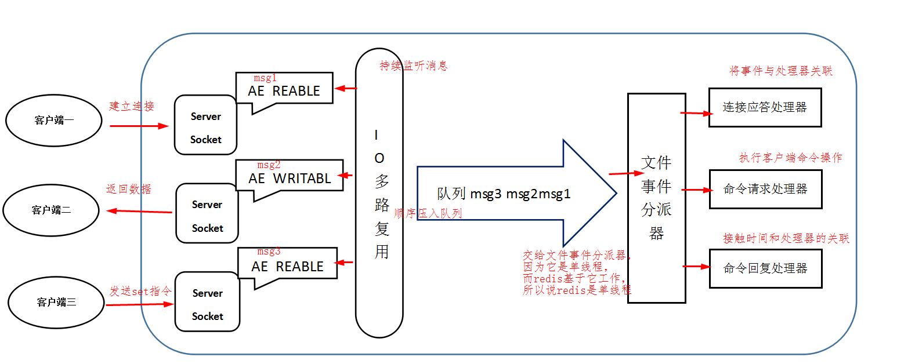

## Redis-线程模型

Redis在单线程下还可以支持高并发的一个重要原因就是Redis的线程模型: **基于非阻塞的IO多路复用机制**。

### 1. Redis是单线程还是多线程?

 Redis是多线程还是单线程? 这个问题, 不能简单的就回答单线程。

 > Redis单线程确实是单线程模型, 但是这指的是Redis命令核心模块是单线程的, 而不是整个Redis实例就一个线程。Redis其他模块都有各自的线程。

Redis是基于reactor模式开发的网络时间处理器, 这个处理器叫做 **文件事件处理器(`file event handler`)** 。如下图描述:

**文件事件处理器**的组成结构为4部分: 多个套接字, IO多路服务程序, 文件事件分派器, 事件处理器。

**因为文件事件分派器队列的消费是单线程的，所以Redis才叫单线程模型。**

### 2. Redis文件事件处理器详解

我们知道文件事件处理器分为4部分:

- 多个Socket;

- IO多路复用程序;

- 文件事件分派器;

- 事件处理器;

它们之间的流程为:

1. 多个socket会产生不同的事件;在Redis中, Socket会产生`AE_READABLE`和`AE_WRITABLE`事件:

    - 当处理的是可读操作时, socket会产生一个`AE_READABLE`事件;

    - 当处理写操作时, socket会产生一个`AE_WRITABLE`事件;

2. IO多路复用程序用来监听所有的socket, 当这些socket产生了事件, IO多路复用程序就会把这些事件放到队列中;

3. 根据队列的特性(先进先出) 文件事件分派器负责将队列中的事件有序且同步的分派给不同的事件处理器。事件处理器包括:**连接应答处理器, 命令请求处理器,命令回复处理器。**

    - 如果客户端要连接Redis, 那么socket会关联连接应答处理器;

    - 如果客户端要写数据到Redis, 那么socket会关联命令请求处理器;

    - 如果客户端要从redis中读数据, 那么socket会关联命令回复处理器;

### 3. Redis通信流程

根据上面对Redis文件事件处理器的解析, 我们就可以理解Redis处理与客户端通信的具体流程。

针对所有的请求命令, 不管是Redis服务端本身, 还是客户端; 不论是写操作还是读操作, 都会通过文件事件处理器的4个部分处理整个过程。

它们处理的关联, 就是通过socket所产生的时间不同, 而执行不同的处理器。具体请求处理流程如下:

1. Redis启动初始化时, Redis作为服务端本身会产生一个socket(`server socket`), 这个socket会产生一个`AE_READABLE`事件与连接应答处理器关联; 当有客户端连接Redis时, 该连接应答处理器就会与客户端建立连接, 并创建与该客户端响应的socket;

2. 当客户端与Redis服务端连接时, 客户端对应的socket也会产生一个`AE_READABLE`事件, 并与命令请求处理器关联起来;

    > 这里要注意的是, Redis与客户端都会socket并产生`AE_READABLE`事件, 但是连接处理器是不同的;

    - Redis中的`server socket`产生`AE_READABLE`事件, 与连接应答处理器关联;

    - 客户端的socket `AE_READABLE`事件, 与命令请求处理器关联;

3. 如果客户端向Redis发送一个写操作命令, 也就是(`set k1 v1`), 这时socket会产生一个`AE_READABLE`事件, IO多路复用程序会将该事件压入队列中, 此时文件事件分派器从队列中获取事件, 由于客户端与Redis连接时, 客户端socket的`AE_READABLE`事件已经和命令请求处理器关联, 所以文件事件分派器会将该事件交给命令请求处理器处理, 读取数据。操作完成后, 该客户端socket会产生一个`AE_WRITABLE`事件与命令回复处理器关联;

4. 如果客户端已经准备好接受数据后, Redis 中的客户端socket 会产生一个 `AE_WRITABLE` 事件，同样会压入队列然后被事件派发器取出交给相对应的命令回复处理器，由该命令回复处理器将准备好的响应数据写入 socket 中，供客户端读取;

5. 命令回复处理器写完后，就会删除该 socket 的 `AE_WRITABLE` 事件与命令回复处理器的关联关系。

### 4. 再次理解Redis单线程

通过上面对Redis线程模型的解析我们可以看到, 由于文件事件分派器获取队列事件是单线程操作的, 而这部分是Redis处理请求的核心模块, 所以Redis是单线程模型。

一般来说, Redis的瓶颈不在CPU, 而是内存和网络。

如果内存不够, 可以通过加内存或者对数据结构进行优化, 可以解决, 但是网络性能的优化才是重点。

网络IO的读写在Redis整个执行期间占用了大部分的CPU时间, 如果把网络处理这部分做成多线程处理方式, 那么对整个Redis的性能会有很大的提升。

目前在2021-02-20, 最新的Redis6.0版本中, 已经推出了IO多线程处理模式, 但是默认是不开启的, 所以目前Redis多线程模型还在验证阶段。