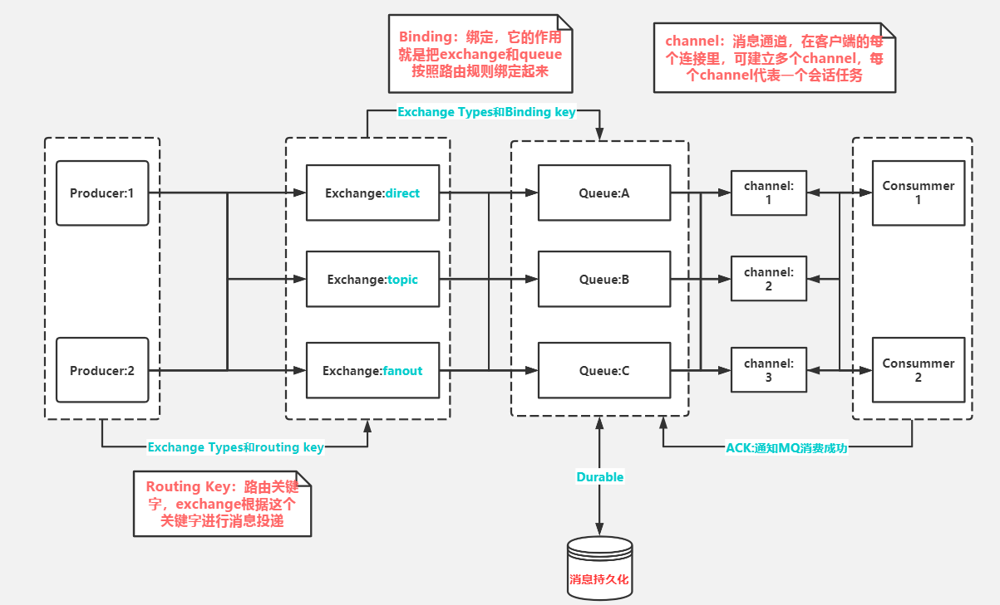
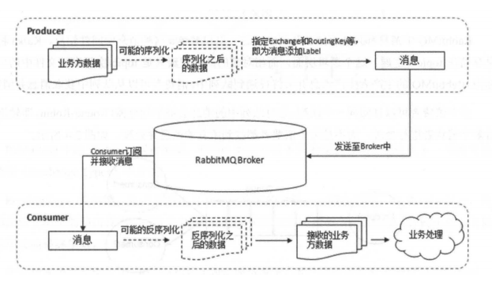

## RabbitMQ 原理解析


### 1. RabbitMQ消息发送原理

应用程序和`Rabbit Server`之间会创建一个TCP连接, 一旦TCP连接成功, 并且通过认证, 就会创建一条AMQP通道(Channel)。

通道是创建在TCP上的虚拟连接, AMQP命令都是通过通道发送, 每个通道都会有一个唯一的ID, 不论是发布消息, 订阅队列或者介绍消息都是通过通道完成的。

> 为什么不通过TCP直接发送命令?

创建和销毁TCP连接的开销很大, 加入高峰期每秒有很多条连接, 每个连接都要创建一个TCP会话, 就会造成了TCP连接的巨大浪费, 而且操作系统每秒能创建的TCP也是有限的, 因此很快就会遇到系统瓶颈。

如果我们每个请求都是只用一条TCP连接, 既满足性能需求, 又能确保每个连接的私密性, 就需要引入通道的概念。

### 2. Rabbit相关概念

- **ConnectionFactory(连接管理器):** 程序与Rabbit之间建立连接的管理器。

    这里管理的连接是TCP连接, 因为每个客户端维护一个TCP连接, 所以需要连接管理器, 来管理所有客户端的TCp连接。

- **Channel(通道):** 消息推送使用的通道。

    这个通道就是我们之前说的虚拟通道。它是建立在TCP连接的基础上, 可以理解为一个TCP连接有多个通道, 客户端通过这些Channel来发送消息。

- **Queue(队列):** 用于存储生产者的消息。

- **Exchange(交换器):** 用于接受, 分配消息。

    这是RabbitMQ的核心组件, 负责从生产者接受数据, 并根据交换类型分发到对应的队列中。**所以要实现消息的接收, 必须要一个队列绑定一个交换机, 至于怎么绑定, 那就需要绑定键(Binging key)的支持**

- **BindingKey(绑定键):** 用于把交换器的消息绑定到队列上。

- **RoutingKey(路由键):** 用于把生产者的数据根据路由规则分配到对应的交换器上。

    路由键的意思可以理解为一种自定义的路由规则, 交换机根据这个规则来分发消息到对应的队列中。

这其中最混淆的就是绑定键与路由键。

1. **路由键是一种消息属性, 交换器根据路由键来决定匹配队列, 把消息存入相应的队列;**

2. **绑定键只负责将交换机与每个队列进行绑定连接。**

    > 我个人理解就是相当于交换器与队列建立关联通道, 以便进行消息的分发操作。

所以我们可以画出RabbitMQ的详细流程图:



### 3. 消息持久化

Rabbit队列和交换器在默认情况下重启服务会导致消息丢失, 解决这种问题就是消息持久化。

想要Rabbit消息能恢复必须满足3个条件:

1. 投递消息时`durable`设置为true, 消息持久化
    ```java 
    channel.queueDeclare(x, true, false, false, null) 
    ```

2. 设置投递模式`deliveryMode`
    ```java
    channel.basicPublish(x, x, MessageProperties.PERSISTENT_TEXT_PLAIN,x) 
    ```

3. 消息已经到达持久化交换器上;

4. 消息已经到达持久化的队列。

**持久化工作原理: Rabbit会将你的持久化消息写入磁盘上的持久化日志文件, 等消息被消费后, Rabbit会把这条消息标识等待垃圾回收。**

**持久化的缺点:**
> 消息持久化的缺点很明显就是性能问题。因为要写入硬盘要比写入内存性能低很多, 从而降低了服务器的吞吐量, 尽管使用SSD可以使性能提交, 但是当消息很多条要写入磁盘时, 性能还是很低的。

### 4. 虚拟主机

每个Rabbit都能创建很多vhost, 称为虚拟主机, 每个虚拟注解都是mini版的RabbitMQ, 拥有自己的队列, 交换器和绑定, 拥有自己的权限机制。

**vhost特性:**

- RabbitMQ默认的vhost是"/"开箱即用。
- 多个vhost是隔离的, 多个vhost无法通讯, 并且不用担心命名冲突, 实现了多层分离。
- 创建用户时必须指定vhost。

#### 2.3 Broker(消息中间件的服务节点)

对于RabbitMQ来说, 一个RabbitMQ Broker可以看做一个RabbitMQ服务节点, 获取Rabbit服务实例。



