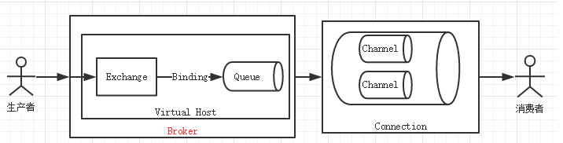

## RabbitMQ事务和Confirm消息确认

我们知道, **如果要保证消息的可靠性, 需要对消息进行持久化处理, 然而消息持久化除了需要代码的设置之外, 还有非常重要的一步就是保证你的消息顺利进入Broker(代理服务器)**



正常情况下, 如果消息经过交换器进入队列就可以完成消息的持久化, 但是如果消息在没有到达Broker之前出现意外, 那就造成消息丢失。

RabbitMQ有两种方式来解决这个问题:

1. 通过AMQP提供的事务机制实现;
2. 使用发送者确认模式实现。

### 1. 事务使用

事务的实现主要是对信道(Channel)的设置:

- `channel.txSelect()`声明启动事务模式;
- `channel.txComment()`提交事务;
- `channel.txRollback()`回滚事务;

具体代码示例:

```java
// 创建连接
ConnectionFactory factory = new ConnectionFactory();
factory.setUsername(config.UserName);
factory.setPassword(config.Password);
factory.setVirtualHost(config.VHost);
factory.setHost(config.Host);
factory.setPort(config.Port);	
Connection conn = factory.newConnection();
// 创建信道
Channel channel = conn.createChannel();
// 声明队列
channel.queueDeclare(_queueName, true, false, false, null);
String message = String.format("时间 => %s", new Date().getTime());
try {
	channel.txSelect(); // 声明事务
	// 发送消息
	channel.basicPublish("", _queueName, MessageProperties.PERSISTENT_TEXT_PLAIN, message.getBytes("UTF-8"));
	channel.txCommit(); // 提交事务
} catch (Exception e) {
	channel.txRollback();
} finally {
	channel.close();
	conn.close();
}
```

在发送消息之前需要声明channel为事务模式, 提交或者回滚事务即可。所以客户端与服务端交互的流程为:

- 客户端发送给服务器 `Tx.Select`(开启事务模式)
- 服务端返回 `Tx.Select-OK`(开始事务模式OK)
- 推送消息
- 客户端发送给事务提交`Tx.Commit`
- 服务端返回`Tx.Commit-OK`

上面是就完成事务的交互流程, 如果其中任意一个环节出了问题, 就会抛出`IOException`异常, 这样用户就可以拦截异常进行事务回滚, 或者决定要不要重复消息。

> 上面的解释都是在生产者端的基础上, 发送消息要保证消息的可靠性, 但是在消费者端能否使用事务?
>
> 消费者模式也是可以使用事务的, 也就是在消息确认之后进行事务回滚。那么这样整个消息的状态就会有两种结果:
>
> 1. autoAck=false手动应对的时候是支持事务的，也就是说即使你已经手动确认了消息已经收到了，但在确认消息会等事务的返回解决之后，在做决定是确认消息还是重新放回队列，如果你手动确认现在之后，又回滚了事务，那么已事务回滚为主，此条消息会重新放回队列;
>
> 2. autoAck=true如果自定确认为true的情况是不支持事务的，也就是说你即使在收到消息之后在回滚事务也是于事无补的，队列已经把消息移除了;


但是既然已经有了事务模式, 为什么还需要发送方模式呢? **因为事务的性能非常的差。**

### 2. Confirm发送方确认模式

Confirm发送方确认模式使用和事务类似, 也是通过设置Channel进行发送发确认的。

> 这里要注意的, 我们一般讨论的消息确认模式, 一般都是在生产者端, 而消费者端只是确认消息消费成功, 返回给Broker。

> Confirm的三种实现方式:

- `channel.watForConfirms()`普通发送方确认模式;

- `channel.waitForConfirmsOrDie()`批量确认模式;

- `channel.addConfirmListener()`异步监听发送方确认模式。

#### 2.1 普通confirm模式

代码:

```java
// 创建连接
ConnectionFactory factory = new ConnectionFactory();
factory.setUsername(config.UserName);
factory.setPassword(config.Password);
factory.setVirtualHost(config.VHost);
factory.setHost(config.Host);
factory.setPort(config.Port);
Connection conn = factory.newConnection();
// 创建信道
Channel channel = conn.createChannel();
// 声明队列
channel.queueDeclare(config.QueueName, false, false, false, null);
// 开启发送方确认模式
channel.confirmSelect();
String message = String.format("时间 => %s", new Date().getTime());
channel.basicPublish("", config.QueueName, null, message.getBytes("UTF-8"));
if (channel.waitForConfirms()) {
	System.out.println("消息发送成功" );
}
```

看代码可以知道，我们只需要在推送消息之前，channel.confirmSelect()声明开启发送方确认模式，再使用channel.waitForConfirms()等待消息被服务器确认即可。

#### 2.2 批量confirm模式

```java
// 创建连接
ConnectionFactory factory = new ConnectionFactory();
factory.setUsername(config.UserName);
factory.setPassword(config.Password);
factory.setVirtualHost(config.VHost);
factory.setHost(config.Host);
factory.setPort(config.Port);
Connection conn = factory.newConnection();
// 创建信道
Channel channel = conn.createChannel();
// 声明队列
channel.queueDeclare(config.QueueName, false, false, false, null);
// 开启发送方确认模式
channel.confirmSelect();
for (int i = 0; i < 10; i++) {
	String message = String.format("时间 => %s", new Date().getTime());
	channel.basicPublish("", config.QueueName, null, message.getBytes("UTF-8"));
}
channel.waitForConfirmsOrDie(); //直到所有信息都发布，只要有一个未确认就会IOException
System.out.println("全部执行完成");
```

以上代码可以看出来channel.waitForConfirmsOrDie()，使用同步方式等所有的消息发送之后才会执行后面代码，只要有一个消息未被确认就会抛出IOException异常。

#### 2.3 异步confirm模式

```java
// 创建连接
ConnectionFactory factory = new ConnectionFactory();
factory.setUsername(config.UserName);
factory.setPassword(config.Password);
factory.setVirtualHost(config.VHost);
factory.setHost(config.Host);
factory.setPort(config.Port);
Connection conn = factory.newConnection();
// 创建信道
Channel channel = conn.createChannel();
// 声明队列
channel.queueDeclare(config.QueueName, false, false, false, null);
// 开启发送方确认模式
channel.confirmSelect();
for (int i = 0; i < 10; i++) {
	String message = String.format("时间 => %s", new Date().getTime());
	channel.basicPublish("", config.QueueName, null, message.getBytes("UTF-8"));
}
//异步监听确认和未确认的消息
channel.addConfirmListener(new ConfirmListener() {
	@Override
	public void handleNack(long deliveryTag, boolean multiple) throws IOException {
		System.out.println("未确认消息，标识：" + deliveryTag);
	}
	@Override
	public void handleAck(long deliveryTag, boolean multiple) throws IOException {
		System.out.println(String.format("已确认消息，标识：%d，多个消息：%b", deliveryTag, multiple));
	}
});
```

异步模式的优点，就是执行效率高，不需要等待消息执行完，只需要监听消息即可。

一般情况下, confirm批量模式与confirm异步模式性能相差不大, 但是confirm确认模式比事务速度更快。