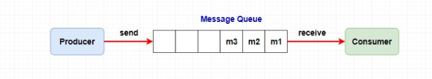
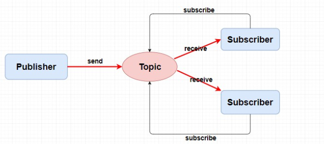
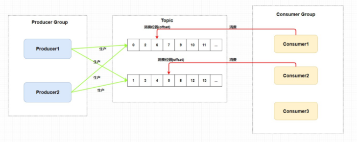
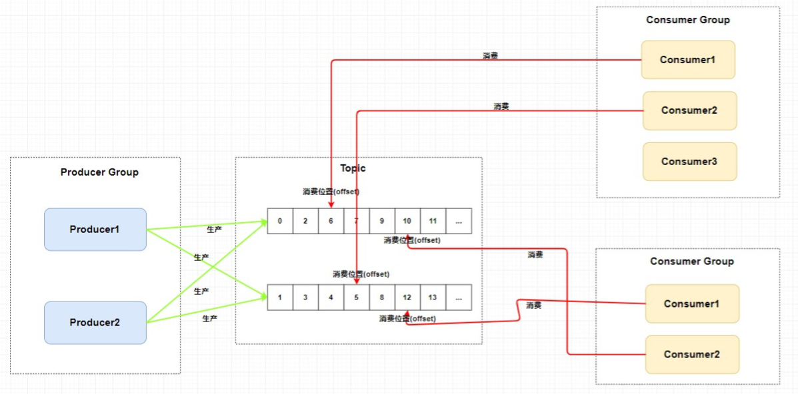

## RocketMQ基本概念

> 什么是RocketMQ?

`RocketMQ`是一个队列模型的消息中间件, 具有**高性能, 高可靠, 高实时, 分布式**的特点。

### 1. 队列模型和主题模型

#### 1.1 队列模型

队列模型就是一个队列, 但是如果我们需要将一个消息发送给多个消费者(比如发送短信和邮件), 这时候单个队列就不能满足需求了。

这个问题是可以解决, 让`Producer`生产者生产消息放入多个队列, 然后每个队列去对应每一个消费者。但是很明显创建多个队列并且复制多份消息会很影响资源和性能。

而且, 这种就会导致生产者需要知道具体消费者个数然后去复制对应数量的消息队列, 这就违背消息中间件的**解耦**原则。

#### 1.2 主题模型

在主题模型中, 消息的生产者称为**发布者(Publisher)**, 消息的消费者称为**订阅者(Subscriber)**, 存放消息的容器称为**主题(Topic)**。

发布者将消息发送到指定主题中, 订阅者需要**提前订阅主题**才能接受特定主题的消息。

#### 1.3 RocketMQ中的消息模型

`RocketMQ`的消息模型就是按照**主题模型**所实现的。

`Kafka`中的**分区**, `RocketMQ`中的**队列**, `RabbitMQ`中的`Exchange`。其实都是消息中间件的主题模型的底层基础。而**主题模型/发布订阅模型**就是一个标准, 消息中间件都是按照这个标准来实现的。

- `Producer Group`生产者组: 代表一类的生产者, 一般生成相同的消息。例如多个秒杀系统作为生产者, 多个系统就是`Producer Group`生产者组。
- `Consumer Group`消费者组: 代表一类消费者, 一般消费相同的消息。例如多个短信系统作为消费者。
- `Topic`主题: 代表一类消息, 例如订单消息, 物流消息。

从图中可以看出生产者组向主题发送消息, 而**主题中存在多个队列**, 生产者每次生成消息之后想指定主题中的某个队列发送消息。

每个主题中都有多个队列, 集群模式下, 一个消费者集群共同消费一个`topic`的多个队列, **一个队列只会被一个消费者消费。**如果某个消费者挂掉. 分组内的其他消费者会接替挂掉的消费者继续消费。就像上图中的`Consumer1`和`Consumer2`分别对应两个队列, 而`Consumer3`是没有队列对应的, 所以**一般来说消费者组中的消费者个数和主题中队列个数相同。**

> 为什么每个消费组在每个队列上维护一个消费位置?

因为在发布订阅模式中一般会涉及多个消费者组, 而每个消费者组在每个队列中的消费位置都是不同的。如果此时有多个消费者组, 那么消息被一个消费者组消费完成之后是不会删除的(因为其他消费者组也需要), 它仅仅是为每个消费者组维护一个**消费位移(offset)**, 每次消费者组消费完会返回一个成功的响应, 然后队列再把维护的消费位移加一, 这样就不会出现刚刚消费过的消息再一次被消费了。

> 为什么一个主题中需要维护多个队列?

主要是为了**提高并发能力。** 如果每个主题只存在一个队列, 这个队列也维护着每个消费者组的消费位置, 这样也可以做到**发布订阅模式**。但是这样生成者只能向一个队列发送消息, 而且又因为需要维护消费位置所以一个队列只能对应一个消费者组。

**`RocketMQ`通过使用一个`Topic`中配置多喝队列并且每个队列维护每个消费者组的消费位置实现了主题模式/发布订阅模式。**

